# Strategy Workbench 처음 사용하기

이 도구로 하는 일은 세 가지다.

1. 매매 규칙을 YAML 파일로 적는다.
2. 어떤 종목이 왜 선택됐는지 중간값을 확인한다.
3. 그 규칙으로 백테스트를 돌린다.

YAML은 엑셀의 설정표를 `항목: 값` 형태의 글로 적은 것이라고 생각하면 된다. 처음부터 문법을
외울 필요 없이 아래 샘플을 복사하고 기간·종목 수·비중 같은 값만 바꾸면 된다.

처음에는 아래 순서만 그대로 따라 하면 된다. 전체 과정은 약 10분 걸린다.

> 지금 기본 데이터는 개발용 가짜 시세(PIT mock)다. 화면 사용법과 계산 흐름을 시험하기 위한
> 데이터이며 실제 투자 결과가 아니다. 왼쪽의 배포·실시간·주문·리스크 메뉴도 아직 실제
> 자동매매 기능이 아니다.

가장 짧게 보면 이 순서다.

1. `http://localhost:5173/`을 연다.
2. 아래 샘플 YAML을 가운데 편집창에 붙여넣는다.
3. 초록색 `검증 통과`를 확인한다.
4. `리비전 저장`을 눌러 v1을 만든다.
5. 아래 `중간 결과`에서 `추적 실행`을 눌러 종목별 점수와 비중을 본다.
6. `실행 설정`에서 `Python reference`를 고른 뒤, 옆의 `백테스트`를 누른다.

## 0. 화면 열기

이미 서버가 켜져 있다면 <http://localhost:5173/>만 열면 된다.

처음 실행한다면 저장소 폴더에서 터미널 두 개를 연다.

```powershell
# 처음 한 번만 설치
npm ci --prefix frontend
```

```powershell
# 터미널 1: 백엔드
uv run server
```

```powershell
# 터미널 2: 프론트엔드
npm run dev
```

브라우저에서 <http://localhost:5173/>을 열면 아래 새 전략 화면이 나온다.

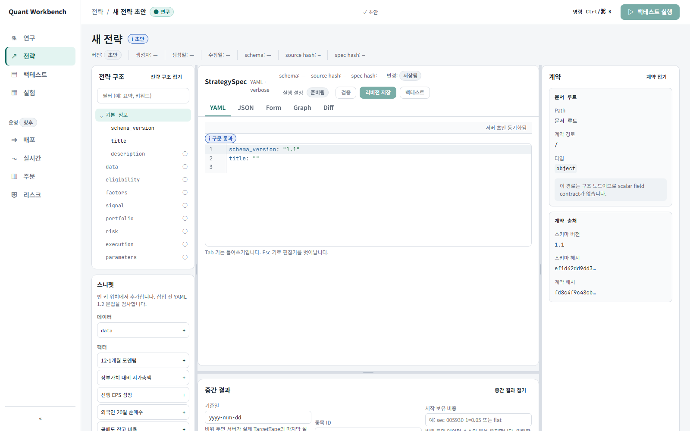

## 1. 샘플 전략 붙여넣기

가운데 큰 편집창을 클릭하고 내용을 모두 지운 뒤 아래 YAML을 붙여넣는다.

```yaml
schema_version: "1.1"
title: "사용자 매뉴얼 모멘텀"
description: ""
data:
  market: KRX
  start: "2021-01-01"
  end: "2026-08-31"
  universe_id: krx.common-stock
  frequency: daily
eligibility:
  rules: []
factors:
  - factor_id: momentum
    label: "모멘텀"
    direction: high
    weight: 0.6
    graph:
      nodes:
        - node_id: close
          field_id: price.close
          kind: field
        - node_id: mom_252
          operator: momentum
          input_node_id: close
          window: 252
          kind: time_series
      output_node_id: mom_252
      missing_policy: drop
portfolio:
  selection_count: 2
  rebalance: monthly
risk:
  max_name_weight: 0.05
execution:
  timing: next_open
  fee_bps: 15.0
parameters: []
```

20종목을 고르도록 설정된 저장소 기본 샘플은
[`quality_momentum.yaml`](../../../backend/tests/fixtures/strategy_documents/quality_momentum.yaml)에서
열 수 있다.

### 이 전략을 사람 말로 풀면

| 설정                      | 뜻                                             |
| ------------------------- | ---------------------------------------------- |
| `market: KRX`             | 한국 주식 대상                                 |
| `start`, `end`            | 2021-01-01부터 2026-08-31까지 테스트           |
| `momentum`, `window: 252` | 최근 252거래일 모멘텀이 높은 종목을 선호       |
| `selection_count: 2`      | 이 연습에서는 점수가 높은 2종목만 선택         |
| `rebalance: monthly`      | 한 달에 한 번 종목과 비중을 다시 계산          |
| `max_name_weight: 0.05`   | 한 종목을 최대 5%까지만 보유                   |
| `timing: next_open`       | 오늘 데이터로 판단하고 다음 거래일 시가에 실행 |
| `fee_bps: 15.0`           | 거래 비용 15bp, 즉 0.15% 적용                  |

붙여넣고 잠시 기다리면 편집창 위에 초록색 `검증 통과`가 나온다.

실제 전략에서는 `selection_count`를 원하는 보유 종목 수로 바꾼다. 여기서는 중간 결과에서
선택된 종목과 탈락한 종목을 모두 보기 위해 2로 두었다.

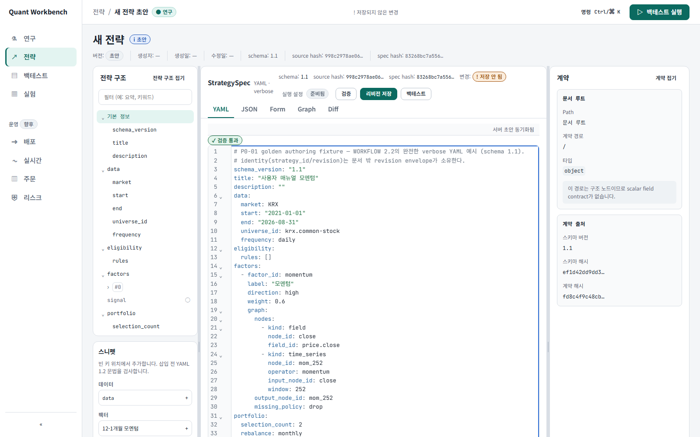

## 2. 숫자 단위 확인하기

왼쪽 `전략 구조`에서 `risk`를 펼치고 `max_name_weight`를 누른다.

오른쪽 `계약` 패널에 다음 내용이 나온다.

- 저장 값: `0.05`
- 화면 표시: `5%`
- 허용 범위와 기본값

즉 YAML에는 `5%`가 아니라 `0.05`를 써야 한다. 거래 비용도 `15bps`가 아니라 `15.0`을 쓴다.

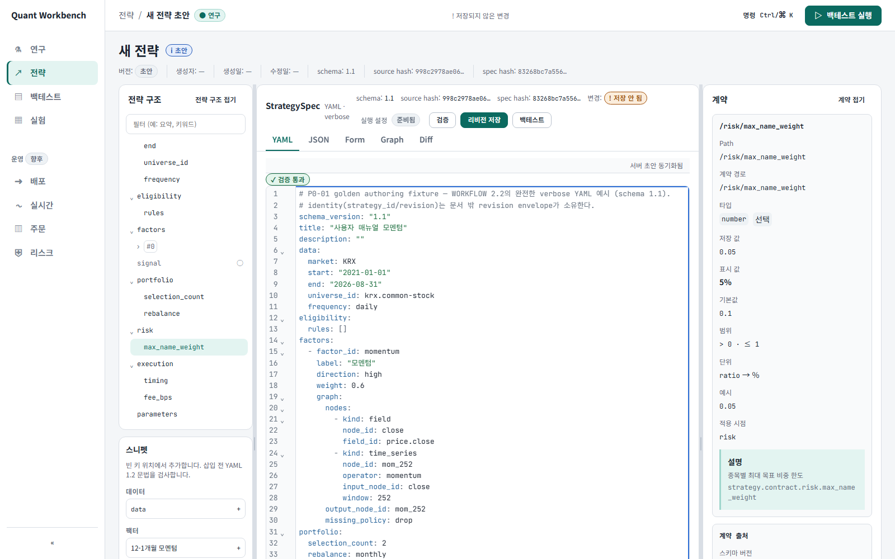

모르는 필드는 외우지 말고 `전략 구조`에서 눌러 오른쪽 설명을 확인하면 된다.

## 3. 오류 고치는 법 익히기

일부러 아래처럼 철자를 틀려 본다.

```yaml
# 잘못된 이름
max_name_wieght: 0.05
```

`검증 통과`가 `구조 오류`로 바뀌고 저장과 백테스트 버튼이 막힌다.

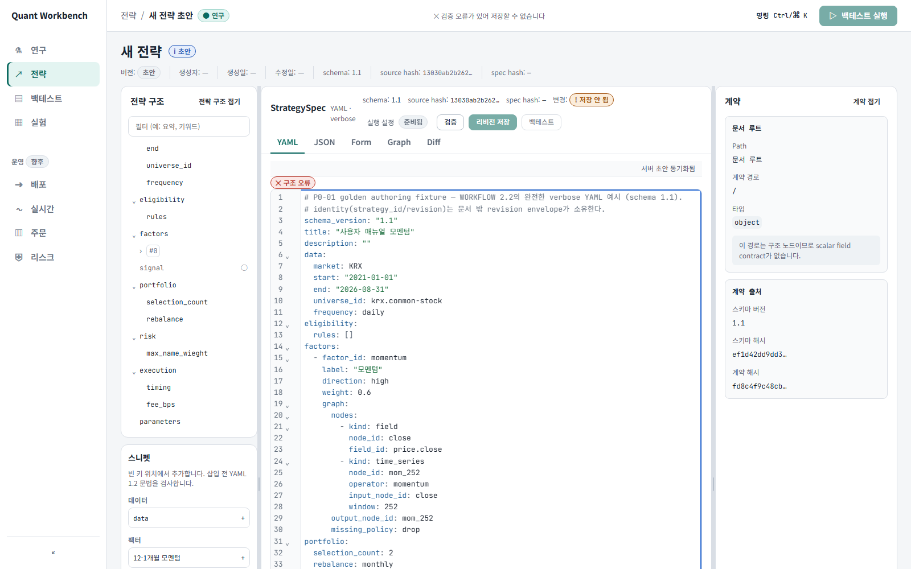

아래쪽 `문제` 목록에 이렇게 뜬다.

```text
모르는 키입니다 혹시 `max_name_weight`인가요? — got='max_name_wieght' suggestion='max_name_weight' allowed=[...]
```

오류를 누르면 틀린 줄로 이동한다. 다시 `max_name_weight`로 고치면 `검증 통과`로 돌아온다.

문장은 늘 `—` 앞뒤로 나뉜다. 앞은 무엇을 어떻게 고치라는 안내이고, 뒤는 그대로 옮겨 붙일 수 있는
값이다(`got=` 실제로 적힌 값, `expected=` 와야 할 것, `allowed=` 고를 수 있는 목록,
`missing=` 빠진 키, `suggestion=` 가까운 후보). 자주 만나는 문장 몇 가지다.

| 상황                       | 문제 목록 문장                                                     |
| -------------------------- | ------------------------------------------------------------------ |
| 목록 자리에 블록을 적었을 때 | 여기에는 목록이 와야 합니다. 항목마다 줄 앞에 `- `를 붙이세요       |
| 필수 키를 빠뜨렸을 때      | 필수 키가 없습니다 — `missing='window'`                             |
| 고를 수 없는 값을 적었을 때 | 고를 수 있는 값이 아닙니다 혹시 …인가요?                            |
| 날짜를 다른 형식으로 적었을 때 | 날짜는 YYYY-MM-DD로 적어 주세요                                   |
| 예전(1.0) 문법을 붙여 넣었을 때 | 1.0 문법입니다 … 업그레이드하세요 (위쪽에 업그레이드 배너가 뜬다) |

팩터 그래프가 서로를 물고 도는 순환이 생기면, 고리에 묶인 노드 카드마다 오류가 붙고 문장이
`cycle=a → b → a`처럼 고리 전체를 보여 준다. 고리 중 한 곳의 입력만 끊으면 된다.

| 화면 문구 | 보통 무엇을 고치면 되나                                  |
| --------- | -------------------------------------------------------- |
| 구문 오류 | 들여쓰기, 콜론(`:`), 따옴표                              |
| 구조 오류 | 필드 이름 오타, 빠진 필드                                |
| 검증 오류 | 잘못된 숫자 범위, 중복 ID, 연결되지 않은 노드            |
| STALE     | 현재 글에 오류가 있어 예전 정상 결과를 잠시 보여 주는 중 |

`STALE` 화면은 참고용일 뿐 그 값으로 저장하거나 실행되지 않는다.

## 4. 전략 저장하기

오류를 모두 고친 뒤 위쪽 `리비전 저장`을 누른다.

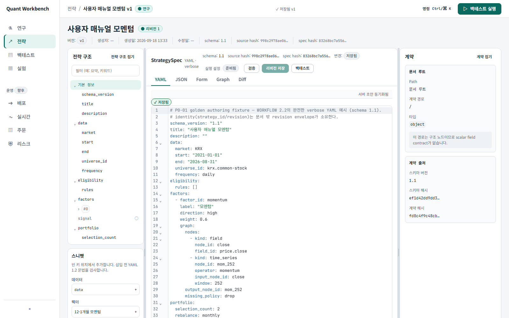

처음 저장하면 `v1`이 생긴다. 다시 고쳐 저장하면 기존 v1을 덮어쓰지 않고 `v2`가 생긴다.
리비전은 “저장한 버전”이라고 이해하면 된다.

예를 들어 제목을 바꾸고 한 번 더 저장한 뒤 `Diff` 탭을 누르면 v1과 v2의 차이를 볼 수 있다.

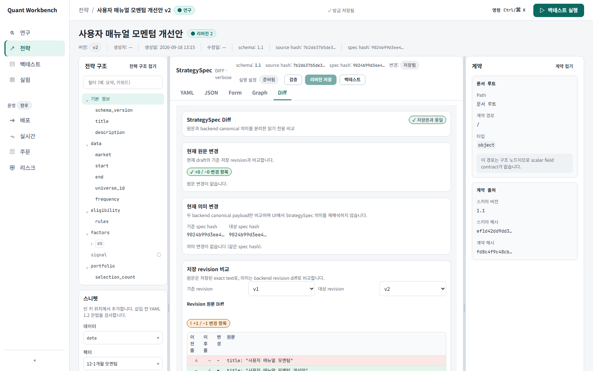

- `원문 변경`은 글자와 주석이 어떻게 바뀌었는지 보여 준다.
- `의미 변경`은 서버가 정리한 StrategySpec 필드가 바뀌었는지 보여 준다. 제목과 설명도
  StrategySpec에 들어 있으므로 여기에 표시된다.

주석만 고쳤다면 원문은 달라도 의미 변경은 없을 수 있다. 실제 매매 동작의 차이를 보려면
`selection_count`, `max_name_weight`, `fee_bps` 같은 필드가 바뀌었는지 확인한다.

붙여넣거나 연 문서의 줄 끝은 편집창이 LF로 통일한다(Windows 메모장의 CRLF 포함). 그래서 아무것도
고치지 않고 저장해도 `source_hash`가 바뀔 수 있다. 전략 의미의 해시(`spec_hash`)는 그대로다.

## 5. 종목이 왜 선택됐는지 확인하기

전략 화면 아래의 `중간 결과`로 내려간다.

1. 종목 ID에 다음 값을 붙여넣는다.
   `sec-005930-1, sec-000660-1, sec-035420-1`
2. 팩터에서 `모멘텀`을 고른다.
3. 노드에서 `mom_252`를 고른다.
4. `추적 실행`을 누른다.
5. `TargetTape` 탭을 누른다.

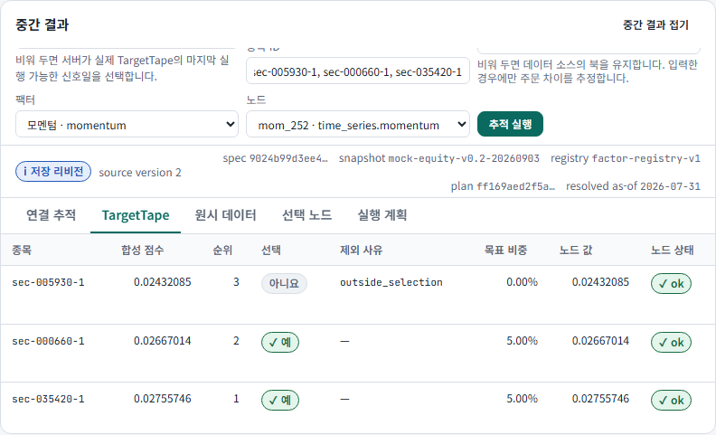

표는 이렇게 읽는다.

| 열        | 뜻                                |
| --------- | --------------------------------- |
| 합성 점수 | 팩터를 모두 합친 최종 점수        |
| 순위      | 점수가 높은 순서                  |
| 선택      | 이번 리밸런싱에 들어가는지        |
| 제외 사유 | 선택되지 않았다면 그 이유         |
| 목표 비중 | 다음 주문이 만들고 싶은 비중      |
| 노드 값   | 지금 고른 중간 계산값             |
| 노드 상태 | 계산 성공, 결측, 데이터 부족 여부 |

위 캡처에서는 1·2위 종목이 선택돼 각각 5%를 받고, 3위는 선택 개수 밖이라 제외됐다.

다른 탭도 필요할 때만 본다.

- `연결 추적`: 종가가 어떤 계산을 거쳐 점수가 됐는지
- `원시 데이터`: 계산에 실제로 들어간 값
- `선택 노드`: 고른 중간 계산 하나의 상세 값
- `실행 계획`: 필요한 과거 데이터 길이와 주문 시점

## 6. 백테스트 돌리기

편집창 바로 위의 `실행 설정`을 누른다. 화면 맨 위의 큰 `백테스트 실행` 버튼은 현재 설정으로
곧바로 실행하므로, 처음에는 누르지 않는다. 아래 값을 입력하면 된다.

| 항목             | 입력값             |
| ---------------- | ------------------ |
| 실행 core        | `Python reference` |
| 초기 자본        | `100000000`        |
| 벤치마크 종목 ID | `sec-005930-1`     |
| 연환산 거래일    | `252`              |
| OOS 시작일       | 비워 둠            |

입력을 마치면 `실행 설정`을 다시 눌러 닫고, 바로 옆의 `백테스트`를 누른다.

### 실패 화면도 한 번 확인하기

초기 자본에 `0`을 넣고 실행하면 서버가 422 오류로 거절한다.

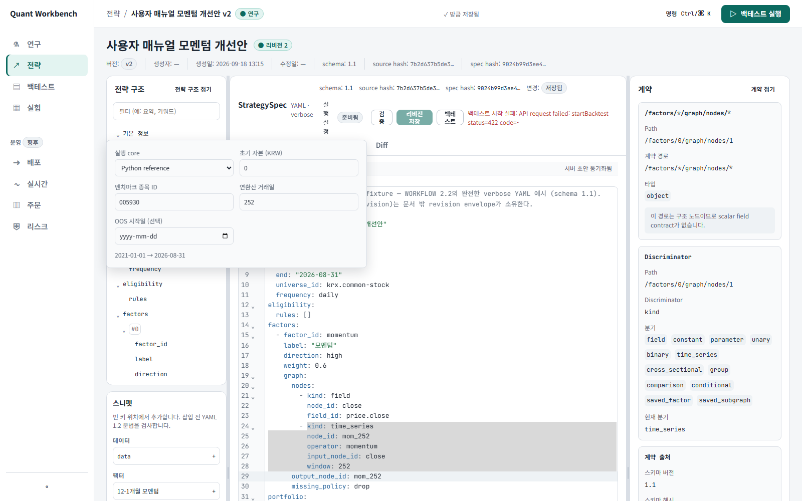

초기 자본을 `100000000`으로 고치고 다시 실행한다. 완료되면 아래 결과 화면으로 이동한다.

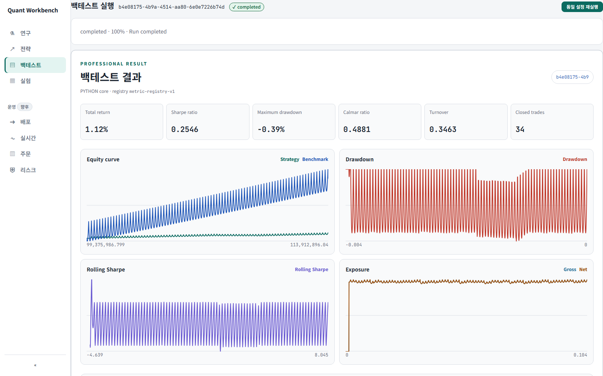

처음에는 아래 여섯 숫자만 확인해도 된다.

| 지표             | 쉬운 뜻                                        |
| ---------------- | ---------------------------------------------- |
| Total return     | 전체 기간 수익률                               |
| Sharpe ratio     | 변동성 대비 수익. 같은 조건끼리 비교할 때 사용 |
| Maximum drawdown | 고점에서 가장 크게 빠진 폭                     |
| Calmar ratio     | 최대 낙폭 대비 수익                            |
| Turnover         | 포트폴리오가 얼마나 자주 바뀌었는지            |
| Closed trades    | 끝까지 청산된 거래 수                          |

그 아래에는 자산 곡선, 낙폭, Rolling Sharpe, 노출도와 월별 수익률이 있다. 맨 아래
`Manifest · 데이터 경고 · 재현성 정보`에는 나중에 같은 실행을 다시 찾기 위한 전략 버전, 데이터,
엔진 정보가 들어 있다.

> 이 샘플의 수익률은 개발용 가짜 시세 결과다. 숫자의 좋고 나쁨보다 화면과 계산 흐름이 제대로
> 연결되는지만 확인한다.

## 7. 저장한 전략 다시 편집하기

기존 전략 편집 기능은 이미 있다.

1. 왼쪽 메뉴에서 `전략`을 누른다.
2. 원하는 전략의 `최신본 열기`를 누른다.
3. 예전 버전을 고치려면 `Revision 펼치기`를 누르고 원하는 vN의 `편집`을 누른다.
4. 버전끼리 비교하려면 같은 줄의 `Diff`를 누른다.

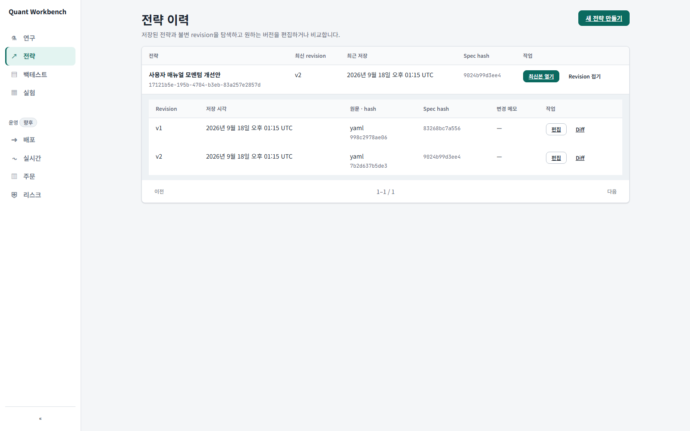

다른 브라우저 탭에서 누군가 먼저 새 버전을 저장했다면 충돌 메시지가 나온다. 이때 현재 글을
복사해 둔 뒤 최신본을 열어 변경 내용을 다시 적용하면 된다.

백테스트 결과는 왼쪽 `백테스트`에서 다시 연다.

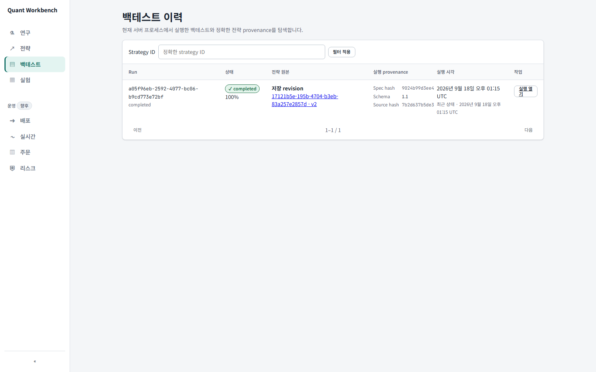

## 8. Form과 Graph에서 고치기

YAML을 직접 치지 않아도 된다. `Form`과 `Graph` 탭에서 고친 값은 YAML의 해당 줄만 바뀌고 주석과
순서는 그대로 남는다. 되돌리기(`Ctrl/⌘+Z`)도 한 번에 한 동작씩이다.

- 라벨은 사람이 읽는 이름을 먼저 보이고 스키마 키(`max_name_weight` 같은 YAML 키)는 그 옆 작은
  글씨로 남는다. 이름·설명·연산자 목록은 backend가 발행하므로 화면과 YAML이 다른 말을 하지 않는다.
- **Form**: 섹션별로 필드가 나열된다. 숫자·글자는 고친 뒤 `Enter`나 다른 곳 클릭으로 반영되고,
  선택 상자와 체크박스는 바로 반영된다. 비어 있는 필드는 기본값을 회색으로 보여 주며 `기본값으로`
  버튼으로 되돌릴 수 있다. `factors`·`parameters`·`eligibility.rules` 같은 목록은 `항목 추가`,
  `카탈로그에서 추가`, `삭제`로 편집한다. 다른 곳이 참조하는 팩터는 삭제되지 않고 참조 위치를 알려 준다.
- **Graph**: `그래프 편집` 영역의 `노드`에는 `연산자 팔레트`가 있다. 무엇을 계산할지(`기간 평균`,
  `순위`, `데이터 필드` …)를 먼저 고르면 노드 종류와 파라미터 기본값이 따라오고 새 노드가 바로
  선택된다. 기간이 필요한 연산자(`기간 평균`·`며칠 전 값` 등)는 허용 최솟값(`window: 1`,
  `periods: 1`)으로 시작하니 원하는 기간으로 바꾼다 — 만들자마자 검증 오류가 나지는 않는다.
  입력으로 이을 노드와 데이터 필드는 처음부터 정해지지 않으니(무엇을 이을지는 사람이 정한다)
  `선택한 노드`에서 고른다. 항목마다 한 줄 설명과 계산식(`mean(x[t-window+1 … t])`)이 함께 보이고, 위쪽 검색칸에
  이름·설명·계산식 일부를 치면 목록이 좁혀진다. 아직 실행할 수 없는 연산자에는 `미지원` 표시와 그
  이유가 붙는다. 편집이 잠겨 있으면 버튼 위에 못 누르는 이유가 그대로 적힌다.
  `선택한 노드`에서 `field_id`·`window` 같은 속성과 `input_node_id` 같은 입력 연결을 고치고,
  `그래프 설정`에서 출력 노드(`output_node_id`)와 결측 정책을 정한다. `node_id`를 바꾸면 같은 그래프에서
  그 노드를 쓰는 입력 연결과 출력 노드도 함께 바뀐다(이미 있는 이름으로는 못 바꾼다). 다른 노드가 입력으로 쓰거나 출력
  노드인 것은 삭제되지 않고, 어떤 노드가 붙잡고 있는지 노드 이름으로 알려 준다. backend가 아직 실행 계획을 만들지 못한 그래프(노드가 없는 새 팩터 등)도
  편집할 수 있다.
- 두 탭 사이는 Form의 `Graph에서 열기`, Graph의 `Form에서 열기`로 오간다.
- 검증이 찾은 오류·경고는 문제 목록뿐 아니라 그 값 바로 아래에도 문장으로 보인다. 문제 목록의 행을
  누르면 접혀 있던 섹션이 펴지고 그 자리로 화면이 옮겨 간다. 배지는 개수만 세고, 원인 문장은 언제나
  본문이라 마우스를 올리지 않아도 읽힌다.
- YAML에 구문 오류가 있으면 Form은 마지막으로 읽을 수 있었던 값을 `STALE`로 보여 주고, Form과 Graph의
  컨트롤은 `구문 오류` 배지와 함께 잠긴다. `YAML` 탭에서 오류를 고치면 바로 풀린다. 방금 고친 값이
  반영되는 짧은 순간(0.2초 정도)에는 항목·노드의 추가·삭제 버튼이 잠시 비활성이다. JSON 문서는 Form·Graph에서 고치지 않는다.

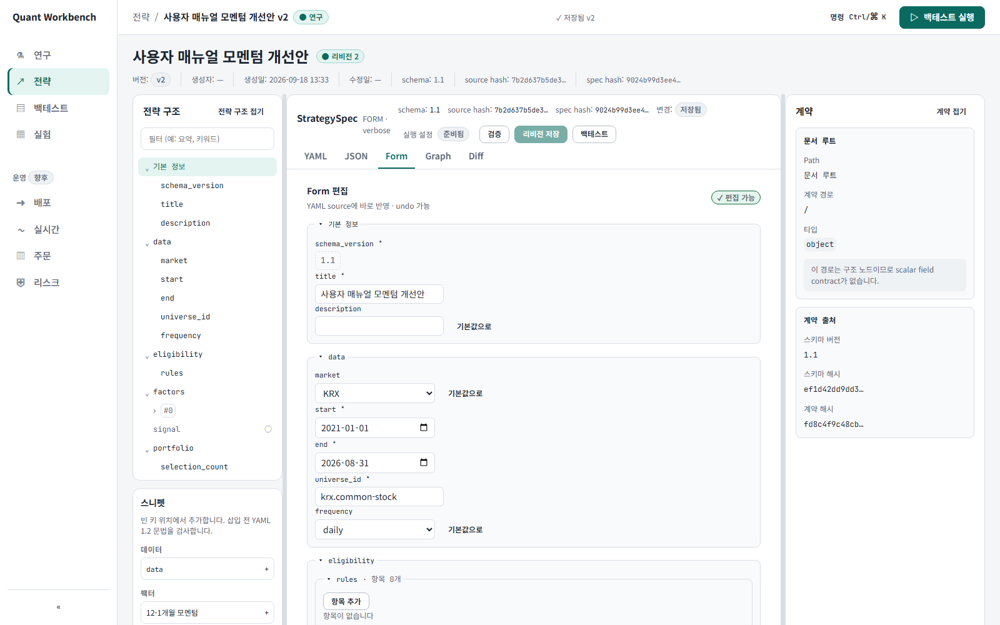

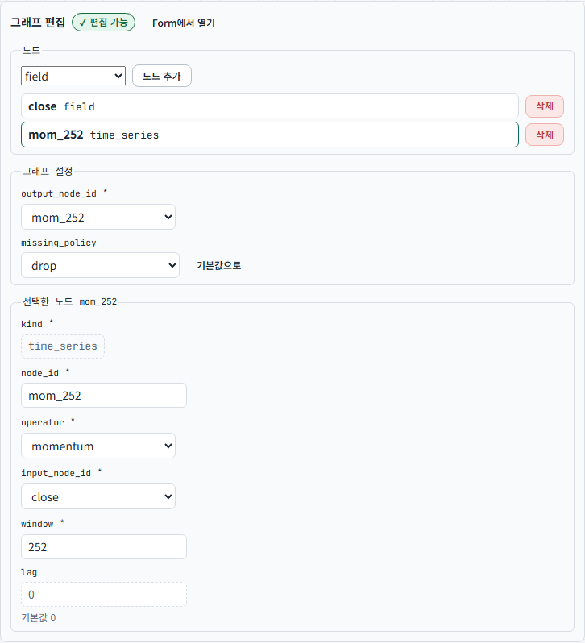

## 9. 자주 쓰는 단축키

`Ctrl+K`를 누르면 명령 검색창이 열린다. macOS에서는 `Ctrl` 대신 `⌘`를 쓴다.

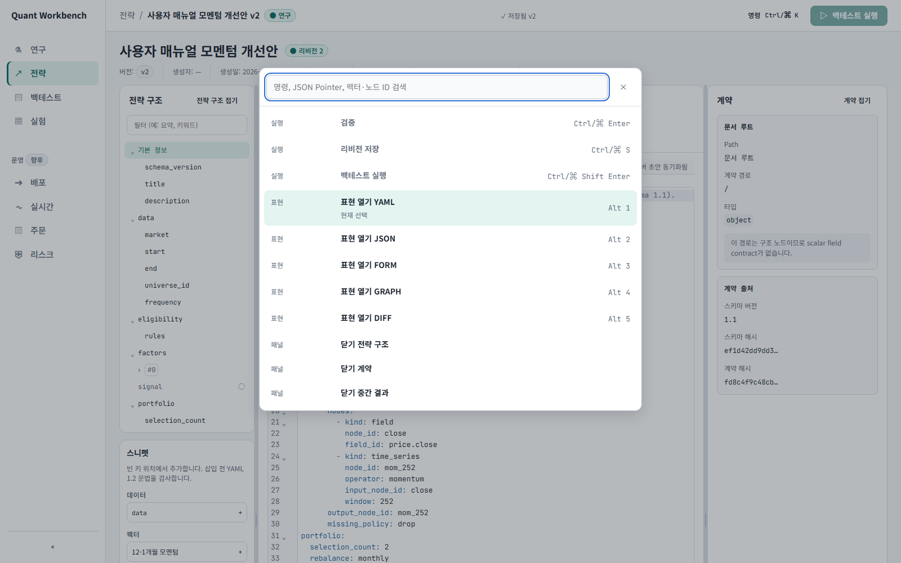

| 키                   | 동작                                  |
| -------------------- | ------------------------------------- |
| `Ctrl/⌘+K`           | 명령 검색창 열기                      |
| `Ctrl/⌘+Enter`       | 현재 YAML 검사                        |
| `Ctrl/⌘+S`           | 새 버전 저장                          |
| `Ctrl/⌘+Shift+Enter` | 백테스트 실행                         |
| `Alt+1` ~ `Alt+5`    | YAML, JSON, Form, Graph, Diff 탭 이동 |

## 막혔을 때 이것부터 확인하기

| 문제                              | 해결 방법                                  |
| --------------------------------- | ------------------------------------------ |
| 화면 자체가 안 열림               | 저장소 루트에서 `npm run dev` 실행         |
| 화면은 열리지만 검사·저장이 안 됨 | `uv run server`가 실행 중인지 확인         |
| backend 확인 필요                 | <http://127.0.0.1:8000/api/v1/health> 열기 |
| Rust `CoreUnavailable`            | 우선 `Python reference`로 실행             |
| 422 오류                          | 초기 자본·연환산 거래일이 0보다 큰지 확인  |
| 저장 버튼이 비활성                | 화면 위 상태가 `검증 통과`인지 확인        |
| STALE 표시                        | 아래 `문제` 목록의 첫 오류부터 수정        |
| 저장한 전략이 안 보임             | 서버가 이전과 같은 DB 경로를 쓰는지 확인   |

## 용어가 헷갈릴 때

| 용어             | 이 문서에서의 뜻                                          |
| ---------------- | --------------------------------------------------------- |
| YAML             | 매매 규칙을 적는 설정 파일                                |
| 리비전(revision) | 한 번 저장한 전략 버전. v1, v2처럼 표시                   |
| 노드(node)       | 종가 읽기, 252일 모멘텀처럼 계산 한 단계                  |
| TargetTape       | 종목별 점수·순위·선택 여부·목표 비중 표                   |
| hash             | 내용이 같은지 확인하는 짧은 지문                          |
| PIT              | 그 날짜 당시에 알 수 있었던 데이터만 사용한다는 뜻        |
| inline draft     | 아직 버전으로 저장하지 않은 현재 YAML                     |
| STALE            | 현재 YAML이 아니라 마지막 정상 계산 결과를 보여 주는 상태 |

여기까지 따라 했다면 전략 작성, 중간값 확인, 저장, 기존 전략 편집, 백테스트의 기본 흐름을 모두
사용한 것이다.

<details>
<summary>개발자용: Rust core 설치와 문서 화면 다시 캡처하기</summary>

Persistent Rust core를 사용하려면 한 번 빌드한다.

```powershell
cd backend
uv sync
uv run maturin develop --manifest-path rust/backtest_core/Cargo.toml --release
cd ..
```

매뉴얼 화면을 다시 캡처할 때는 실제 전략과 백테스트 데이터가 생기므로 별도 임시 DB를 쓴다.

```powershell
# 터미널 1
$manualRunName = "quant-study-manual-$([guid]::NewGuid().ToString('N'))"
$manualRoot = Join-Path ([IO.Path]::GetTempPath()) $manualRunName
New-Item -ItemType Directory $manualRoot | Out-Null
$env:STRATEGY_WORKBENCH_DB_PATH = Join-Path $manualRoot "strategy-workbench.sqlite3"
uv run server
```

```powershell
# 터미널 2
npm run dev
```

```powershell
# 터미널 3
cd frontend
npx playwright install chromium # clean checkout에서는 처음 한 번 필요
$env:WORKBENCH_MANUAL_HEADED = "1"
npm run docs:capture
```

위 첫 명령은 실행할 때마다 새 GUID 폴더를 만들기 때문에 이전 전략과 백테스트가 캡처에
섞이지 않는다. 스크립트도 이번 실행에서 만든 전략 ID와 실행 ID가 이력 화면에 있는지 확인한다.

</details>

개발 구조와 계약을 더 자세히 보려면 다음 문서를 읽는다.

- [메인 README](../../../README.md)
- [전략 작성 계약](../../superpowers/specs/2026-09-04-strategy-authoring-contract-adr.md)
- [구현 진행표](../../planning/strategy-workbench-yaml-ui/PLAN.md)
