# Strategy Workbench 처음 사용하기

이 도구로 하는 일은 세 가지다.

1. 매매 규칙을 YAML 파일로 적는다.
2. 어떤 종목이 왜 선택됐는지 중간값을 확인한다.
3. 그 규칙으로 백테스트를 돌린다.

YAML은 엑셀의 설정표를 `항목: 값` 형태의 글로 적은 것이라고 생각하면 된다. 처음부터 문법을
외울 필요 없이 아래 샘플을 복사하고 종목 수·비중 같은 값만 바꾸면 된다. 기간과 유니버스(후보
종목 목록)는 YAML이 아니라 화면의 **실행 설정**에서 정한다.

처음에는 아래 순서만 그대로 따라 하면 된다. 전체 과정은 약 10분 걸린다.

> 지금 기본 데이터는 개발용 가짜 시세(PIT mock)다. 화면 사용법과 계산 흐름을 시험하기 위한
> 데이터이며 실제 투자 결과가 아니다. 왼쪽의 배포·실시간·주문·리스크 메뉴도 아직 실제
> 자동매매 기능이 아니다.

가장 짧게 보면 이 순서다.

1. `http://localhost:5173/`을 연다.
2. 아래 샘플 YAML을 가운데 편집창에 붙여넣는다.
3. 초록색 `검증 통과`를 확인한다.
4. `리비전 저장`을 눌러 v1을 만든다.
5. 화면 위쪽 실행 설정 요약 띠의 `실행 설정 채우기`를 눌러 시작일·종료일·유니버스를 채운다.
   연습용 값은 `2021-01-01`, `2026-08-31`, `krx.common-stock`이다. 이 세 칸은 기본값이 없어,
   비워 두면 추적과 백테스트가 모두 막힌다(6절).
6. 아래 `중간 결과`에서 `추적 실행`을 눌러 종목별 점수와 비중을 본다.
7. `실행 설정`에서 `Python reference`를 고른 뒤, 옆의 `백테스트`를 누른다.
8. (선택) `설정`에서 AI 공급자를 연결하면 오른쪽 사이드바에서 전략을 물어볼 수 있다(9절).

## 0. 화면 열기

이미 서버가 켜져 있다면 <http://localhost:5173/>만 열면 된다.

처음 실행한다면 저장소 폴더에서 터미널 두 개를 연다.

```powershell
# 처음 한 번만 설치
npm ci --prefix frontend
```

```powershell
# 터미널 1: 백엔드
uv run server
```

```powershell
# 터미널 2: 프론트엔드
npm run dev
```

브라우저에서 <http://localhost:5173/>을 열면 아래 새 전략 화면이 나온다.

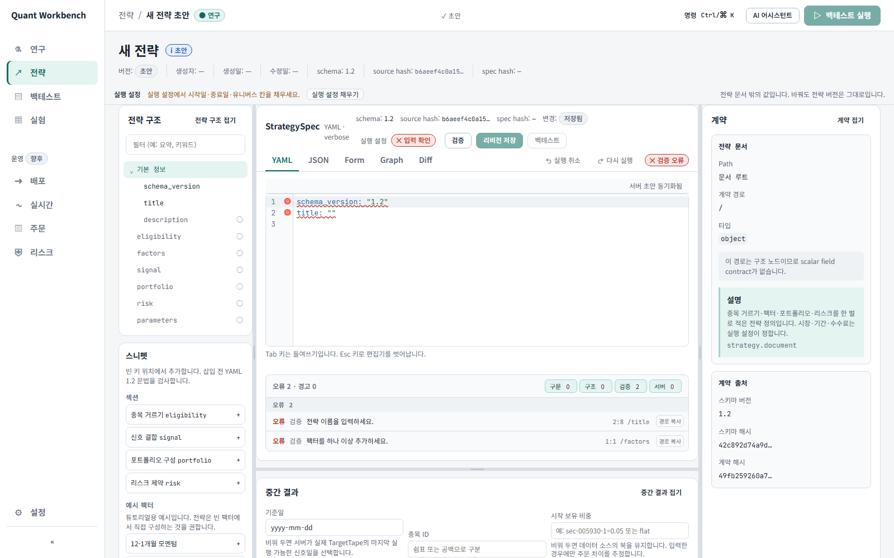

이 브라우저에서 처음 열면 편집창 위쪽 실행 설정 요약 띠에 `실행 설정에서 시작일·종료일·유니버스 칸을 채우세요.`와
`실행 설정 채우기` 버튼이 보인다. 오류가 아니라 아직 실행 설정을 정하지 않았다는 뜻이다. 추적(5절)
전에 채운다.

## 1. 샘플 전략 붙여넣기

가운데 큰 편집창을 클릭하고 내용을 모두 지운 뒤 아래 YAML을 붙여넣는다.

```yaml
schema_version: "1.2"
title: "사용자 매뉴얼 모멘텀"
description: ""
eligibility:
  rules: []
factors:
  - factor_id: momentum
    label: "모멘텀"
    direction: high
    weight: 0.6
    graph:
      nodes:
        - node_id: close
          field_id: price.adj_close
          kind: field
        - node_id: mom_252
          operator: momentum
          input_node_id: close
          window: 252
          kind: time_series
      output_node_id: mom_252
portfolio:
  selection_count: 2
  rebalance: monthly
risk:
  max_name_weight: 0.05
parameters: []
```

20종목을 고르도록 설정된 저장소 기본 샘플은
[`quality_momentum.yaml`](../../../backend/tests/fixtures/strategy_documents/quality_momentum.yaml)에서
열 수 있다.

### 이 전략을 사람 말로 풀면

| 설정                      | 뜻                                       |
| ------------------------- | ---------------------------------------- |
| `momentum`, `window: 252` | 최근 252거래일 모멘텀이 높은 종목을 선호 |
| `selection_count: 2`      | 이 연습에서는 점수가 높은 2종목만 선택   |
| `rebalance: monthly`      | 한 달에 한 번 종목과 비중을 다시 계산    |
| `max_name_weight: 0.05`   | 한 종목을 최대 5%까지만 보유             |

schema 1.2부터 시장·기간·유니버스·체결 시점·수수료·결측 처리는 전략 문서가 아니라 **실행 설정**이 갖는다.
같은 전략을 다른 기간이나 유니버스로 돌려도 전략 revision은 늘지 않는다.

샘플의 모멘텀은 수정주가 `price.adj_close`로 잰다. 원주가 `price.close`는 분할·증자·병합 날 끊겨
가짜 급등락을 만들기 때문이다. 수익률·모멘텀·이평·변동성처럼 과거 세션과 비교하는 연산에 원주가를
넣으면 검증은 통과하지만 "`price.adj_close` 를 쓰세요"라는 경고가 문제 목록에 뜬다. 원주가는 가격
필터처럼 그날의 절대 가격이 필요할 때 쓴다.

붙여넣고 잠시 기다리면 편집창 위 탭 줄 오른쪽에 초록색 `검증 통과`가 나온다. 샘플은 수정주가를 쓰므로
문제 목록에 원주가 경고도 뜨지 않는다.

실제 전략에서는 `selection_count`를 원하는 보유 종목 수로 바꾼다. 여기서는 중간 결과에서
선택된 종목과 탈락한 종목을 모두 보기 위해 2로 두었다.

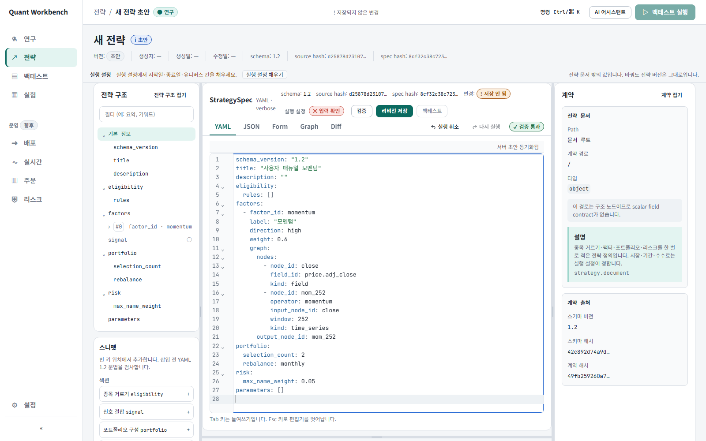

## 2. 숫자 단위 확인하기

왼쪽 `전략 구조`에서 `risk`를 펼치고 `max_name_weight`를 누른다.

오른쪽 `계약` 패널에 다음 내용이 나온다.

- `저장 값`: `0.05`
- `표시 값`: `5%`
- `범위`와 `기본값`

즉 YAML에는 `5%`가 아니라 `0.05`를 써야 한다. 수수료·슬리피지 같은 거래 비용은 YAML에 쓰지 않는다.
실행 설정의 `수수료 (bp)`·`슬리피지 (bp)` 칸에 `15`처럼 bp 숫자로 넣고, `참여율 (%)` 칸에는 `10`처럼
% 숫자로 넣는다(6절). 칸 이름 끝의 괄호가 넣을 단위다.

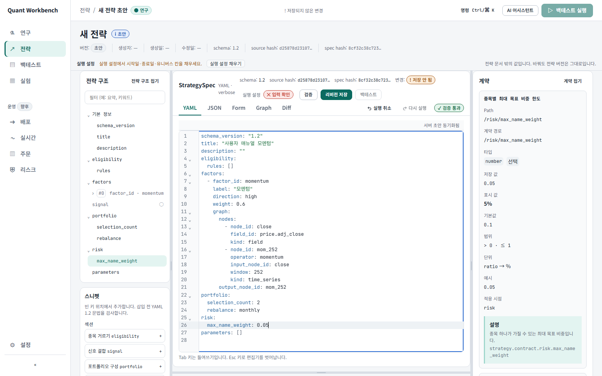

모르는 필드는 외우지 말고 `전략 구조`에서 눌러 오른쪽 설명을 확인하면 된다.

### 재무 필드의 기간

매출·매출총이익·영업이익·순이익·영업현금흐름 필드(`financial.revenue`, `financial.net_income` 등)는
**최근 4분기 합(TTM)** 이다. 분기보고서가 막 나온 날도, 사업보고서가 나온 날도 늘 12개월 값이라
종목끼리 바로 견줄 수 있다. 값은 마지막 분기 보고서가 접수된 다음 거래일부터 보이고, 네 분기 중
하나라도 아직 접수되지 않았거나 빠져 있으면 비어 있다(3개월 값으로 채우지 않는다). 네 분기 중 옛
분기의 정정 보고서가 나중에 접수되면 그 정정본이 접수된 다음 거래일부터 보이고, 그 전에는 비어
있다. 원장이 정정 전 판을 따로 남기지 않아서다.

자본총계·자산총계·부채총계는 보고 기간 말의 잔액이라 합산하지 않는다. 그래서 ROE는
`financial.net_income`(TTM) ÷ `financial.book_equity`(최신 잔액)로 만든다.

2026-09-27에 이 필드들의 뜻이 TTM으로 바뀌었다. 그 무렵 돌린 백테스트의 데이터 스냅샷 id는 원장 판
하나뿐이라(필드 계약 판이 붙기 전) 지금 결과와 앞부분이 같아 보여도 재무 팩터 값은 다르다. 그 전
결과와 숫자를 직접 비교하지 말고 같은 전략을 다시 돌려 비교한다. 지금은 필드의 뜻이 바뀌면 데이터
스냅샷 id 뒷부분이 바뀐다(6장 결과의 `Manifest` 설명).

연결재무제표(CFS)와 별도재무제표(OFS)를 오가는 법인은 전환 뒤 최대 약 7분기 동안 TTM이 비어 있다.
네 분기가 모두 같은 구분이어야 값이 서기 때문이다. 영구 결측은 아니고, 같은 구분의 분기가 다시 차면
값이 선다.

## 3. 오류 고치는 법 익히기

일부러 아래처럼 철자를 틀려 본다.

```yaml
# 잘못된 이름
max_name_wieght: 0.05
```

`검증 통과`가 `구조 오류`로 바뀌고 저장과 백테스트 버튼이 막힌다.

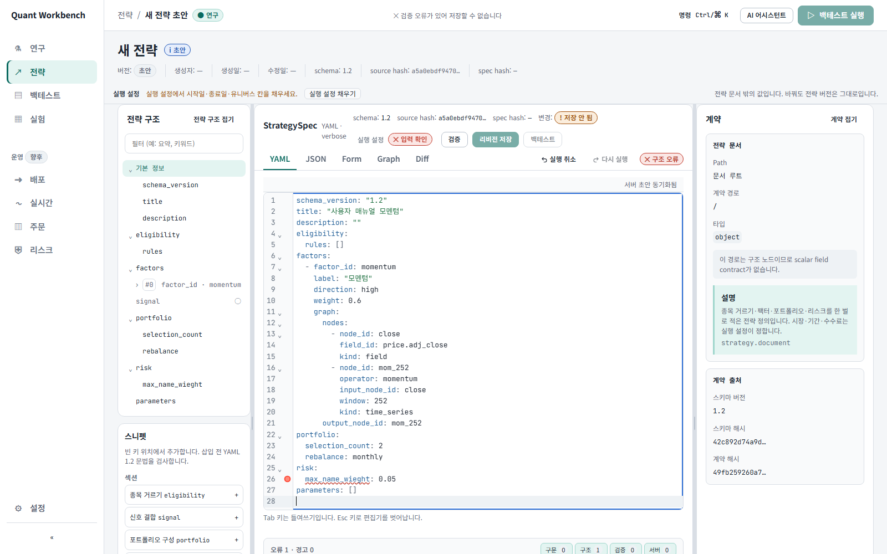

아래쪽 `문제` 목록에 이렇게 뜬다.

```text
모르는 키입니다 혹시 `max_name_weight`인가요? — got='max_name_wieght' suggestion='max_name_weight' allowed=[...]
```

오류를 누르면 틀린 줄로 이동한다. 다시 `max_name_weight`로 고치면 `검증 통과`로 돌아온다.

문장은 대부분 `—`(일부 검증 문장은 `:`) 앞뒤로 나뉜다. 앞은 무엇을 어떻게 고치라는 안내이고, 뒤는 그대로 옮겨 붙일 수 있는
값이다(`got=` 실제로 적힌 값, `expected=` 와야 할 것, `allowed=` 고를 수 있는 목록,
`missing=` 빠진 키, `suggestion=` 가까운 후보). 자주 만나는 문장 몇 가지다.

| 상황                       | 문제 목록 문장                                                     |
| -------------------------- | ------------------------------------------------------------------ |
| 목록 자리에 블록을 적었을 때 | 여기에는 목록이 와야 합니다. 항목마다 줄 앞에 `- `를 붙이세요       |
| 필수 키를 빠뜨렸을 때      | 필수 키가 없습니다 — `missing='window' in='TimeSeriesNode'`         |
| 고를 수 없는 값을 적었을 때 | 고를 수 있는 값이 아닙니다 혹시 …인가요?                            |
| 버전 줄은 `"1.2"`인데 본문에 1.0 문법이 남았을 때 | 1.0 문법입니다. … 또는 1.0에서만 쓰던 키입니다. 지금 버전은 읽지 않으니 지우세요 — … |
| `schema_version`이 `"1.0"`·`"1.1"`인 옛 문서를 붙여 넣었을 때 | 지원하지 않는 schema_version입니다. 업그레이드하면 지금 버전으로 바꿔 줍니다 — `got='1.1' supported=('1.2',)` |
| 버전 줄은 `"1.1"`인데 본문이 1.0 문법일 때 | 선언한 schema_version보다 옛 문법이 본문에 섞여 있어 업그레이드할 수 없습니다. … 문서 전체가 1.0 문법이면 버전 줄을 그 버전(`schema_version: "1.0"`)으로 고쳐 주세요 — … |
| 1.2 문서에 `data`·`execution`을 적었을 때 | 모르는 키입니다 — `got='data'` …                           |
| node_id를 `__promote_`로 시작했을 때 | `__promote_` 로 시작하는 노드 이름은 … 예약 이름입니다. 다른 이름을 쓰세요 |
| (경고) 모멘텀·이평 같은 과거 비교 연산에 원주가 `price.close`를 넣었을 때 | 분할·증자·병합에 조정하지 않은 원주가를 과거 세션과 비교하는 연산에 넣어 … `price.adj_close` 를 쓰세요 |

옛 문서는 버전 줄에 따라 고치는 길이 다르다.

- 버전 줄이 이미 `"1.2"`면 업그레이드 대상이 아니다. 문장이 가리키는 자리를 그대로 고친다.
- 버전 줄이 `"1.0"`·`"1.1"`이고 본문도 그 버전 문법이면 업그레이드가 필요하다. 새 전략 화면에 붙여
  넣었든 저장된 옛 revision을 열었든 편집기 위에 `이전 schema 문서` 배너가 뜬다. 순서는 7절 "옛
  전략(1.0·1.1) 열기"와 같다. 업그레이드하기 전에는 구조 오류라 저장이 막힌다.
- 버전 줄보다 옛 문법이 본문에 섞였거나(예: `"1.1"` 문서에 1.0 문법) 버전 줄에 모르는 값을 적었으면
  배너가 뜨지 않는다. 대신 문제 목록이 버전 줄과 고칠 자리를 말한다. 버전 줄에는 본문을 쓴 버전을
  적는다.
- `data`·`execution`에 적던 시장·기간·유니버스·체결 시점·수수료는 1.2부터 실행 설정이 갖는다.
  YAML에서 지우고 그 값은 실행 설정 칸에 넣는다(6절). `execution`에는 엉뚱하게 `description`을
  권하는 문장이 붙을 수 있는데, 권하는 대로 바꾸지 말고 지운다.
- 원주가 경고는 막는 오류가 아니다. 검증은 통과하지만 수익률·모멘텀처럼 과거 값과 비교하는 연산에는
  수정주가 `price.adj_close`를 쓴다.

팩터 그래프가 서로를 물고 도는 순환이 생기면, 고리에 묶인 노드 카드마다 오류가 붙고 문장이
`cycle=a → b → a`처럼 고리 전체를 보여 준다. 고리 중 한 곳의 입력만 끊으면 된다.

| 화면 문구 | 보통 무엇을 고치면 되나                                  |
| --------- | -------------------------------------------------------- |
| 구문 오류 | 들여쓰기, 콜론(`:`), 따옴표                              |
| 구조 오류 | 필드 이름 오타, 빠진 필드                                |
| 검증 오류 | 잘못된 숫자 범위, 중복 ID, 연결되지 않은 노드            |
| STALE     | 현재 글에 오류가 있어 예전 정상 결과를 잠시 보여 주는 중 |

`STALE` 화면은 참고용일 뿐 그 값으로 저장하거나 실행되지 않는다.

## 4. 전략 저장하기

오류를 모두 고친 뒤 위쪽 `리비전 저장`을 누른다.

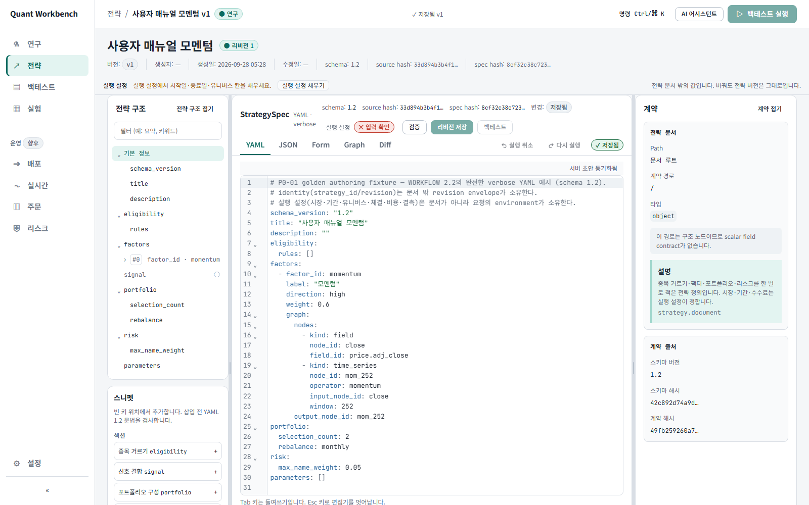

처음 저장하면 `v1`이 생긴다. 다시 고쳐 저장하면 기존 v1을 덮어쓰지 않고 `v2`가 생긴다.
리비전은 “저장한 버전”이라고 이해하면 된다.

예를 들어 제목을 바꾸고 한 번 더 저장한 뒤 `리비전 변경 비교`를 누르면 v1과 v2의 차이를 볼 수 있다.

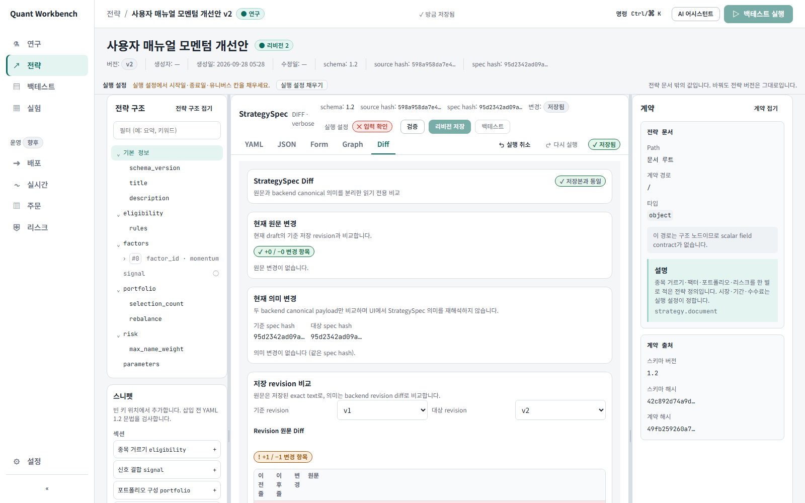

아래쪽 `저장 revision 비교`에서 `기준 revision`과 `대상 revision`을 고른다.

- `Revision 원문 Diff`는 글자와 주석이 어떻게 바뀌었는지 보여 준다.
- `Revision 의미 Diff`는 서버가 정리한 StrategySpec 필드가 바뀌었는지 보여 준다. 제목과 설명도
  StrategySpec에 들어 있으므로 여기에 표시된다.
- 위쪽 `현재 원문 변경`·`현재 의미 변경`은 아직 저장하지 않은 지금 글을 기준 저장본과 견준다.

주석만 고쳤다면 원문은 달라도 의미 변경은 없을 수 있다. 실제 매매 동작의 차이를 보려면
`selection_count`, `max_name_weight` 같은 필드가 바뀌었는지 확인한다. 기간·유니버스·수수료는 전략
문서 밖의 실행 설정이라 이 Diff에 나오지 않는다. 실행마다 쓴 값은 백테스트 결과 맨 아래 Manifest의
`실행 설정`과 `실행 설정 hash`로 본다(6절).

붙여넣거나 연 문서의 줄 끝은 편집창이 LF로 통일한다(Windows 메모장의 CRLF 포함). 그래서 아무것도
고치지 않고 저장해도 `source_hash`가 바뀔 수 있다. 전략 의미의 해시(`spec_hash`)는 그대로다.

## 5. 종목이 왜 선택됐는지 확인하기

추적은 실행 설정의 기간·유니버스 위에서 돈다. 실행 설정을 채우기 전에는 `중간 결과`에
`추적은 실행 설정 위에서 돕니다. 위 실행 설정 요약 띠가 고칠 칸을 알려 줍니다.`가 뜨고 입력칸이
잠긴다.

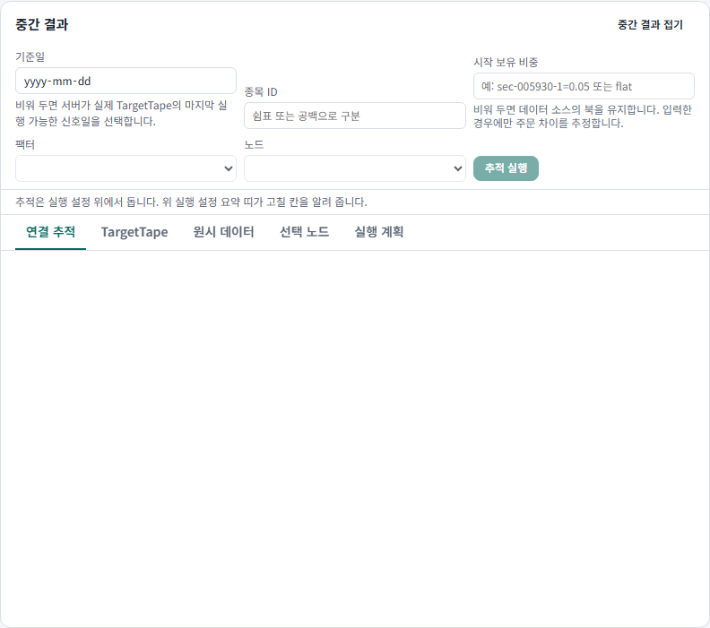

막힌 이유는 이 한 문장뿐이다. 전략 문서는 고칠 것이 없다.

그래서 먼저 실행 설정을 채운다.

1. 화면 위쪽 요약 띠의 `실행 설정 채우기`를 누른다. 실행 설정 패널이 열리고 `시작일` 칸으로 커서가
   간다.
2. `시작일`에 `2021-01-01`, `종료일`에 `2026-08-31`을 넣는다. 날짜 칸은 연·월·일 자리가 따로 있지만
   숫자만 이어 치면 된다. `20210101`이나 `2021-01-01`을 치면 연도 4자리 뒤에 월, 월 2자리 뒤에 일로
   저절로 넘어간다. 다 친 뒤 `Tab`을 한 번 누르면 칸 오른쪽의 달력 버튼으로, 한 번 더 누르면 다음 칸으로
   간다.
3. `유니버스`에 `krx.common-stock`을 넣는다. 기준일마다 후보로 삼을 종목 목록의 ID다.
4. 편집창 바로 위의 `실행 설정`을 다시 눌러 패널을 닫는다. 요약 띠에 방금 넣은 값이 보이면 된다.

이 값은 이 브라우저에 기억되므로 다음부터는 다시 채우지 않아도 된다. 나머지 칸은 6절에서 본다.

이제 전략 화면 아래의 `중간 결과`로 내려간다.

1. 종목 ID에 다음 값을 붙여넣는다.
   `sec-005930-1, sec-000660-1, sec-035420-1`
2. 팩터에서 `모멘텀`을 고른다.
3. 노드에서 `mom_252`를 고른다.
4. `추적 실행`을 누른다.
5. `TargetTape` 탭을 누른다.

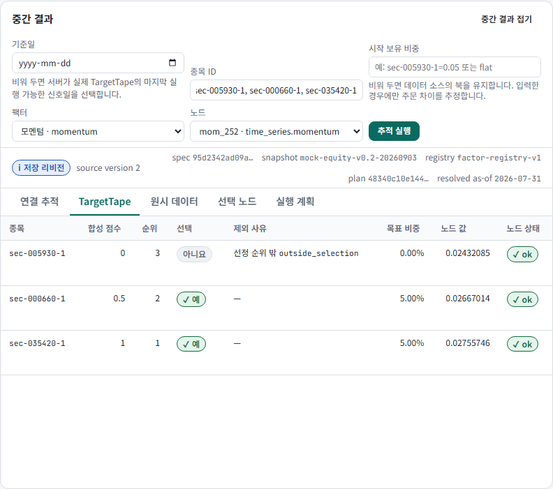

표는 이렇게 읽는다.

| 열        | 뜻                                |
| --------- | --------------------------------- |
| 합성 점수 | 팩터를 모두 합친 최종 점수        |
| 순위      | 점수가 높은 순서                  |
| 선택      | 이번 리밸런싱에 들어가는지        |
| 제외 사유 | 선택되지 않았다면 그 이유         |
| 목표 비중 | 다음 주문이 만들고 싶은 비중      |
| 노드 값   | 지금 고른 중간 계산값             |
| 노드 상태 | 계산 성공, 결측, 데이터 부족 여부 |

위 캡처에서는 1·2위 종목이 선택돼 각각 5%를 받고, 3위는 선택 개수 밖이라 제외됐다.

다른 탭도 필요할 때만 본다.

- `연결 추적`: 종가가 어떤 계산을 거쳐 점수가 됐는지
- `원시 데이터`: 계산에 실제로 들어간 값
- `선택 노드`: 고른 중간 계산 하나의 상세 값
- `실행 계획`: 필요한 과거 데이터 길이와 주문 시점

## 6. 백테스트 돌리기

편집창 바로 위의 `실행 설정`을 누르면 실행 설정 패널이 열린다. 화면 맨 위의 큰 `백테스트 실행`
버튼은 현재 설정으로 곧바로 실행하므로, 처음에는 누르지 않는다.

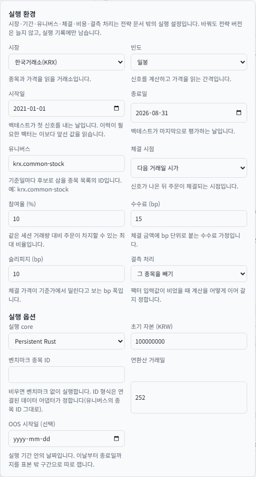

그림은 두 묶음을 한 장에 담으려고 패널을 끝까지 펼쳐 찍었다. 실제 화면에서는 패널 안을 스크롤해 아래
칸을 본다.

패널은 `실행 환경`과 `실행 옵션` 두 묶음이다. 둘 다 전략 문서 밖의 값이라 바꿔도 전략 버전(revision)은
늘지 않고 실행 기록에만 남는다.

**실행 환경** — 어느 시장·기간·종목 목록에서, 어떤 체결·비용 가정으로 돌릴지 정한다. 5절에서 이미
채웠다면 그대로 두면 된다.

| 항목            | 기본값          | 이 연습에서 넣을 값 |
| --------------- | --------------- | ------------------- |
| 시장            | 한국거래소(KRX) | 그대로              |
| 빈도            | 일봉            | 그대로              |
| 시작일          | 없음(필수)      | `2021-01-01`        |
| 종료일          | 없음(필수)      | `2026-08-31`        |
| 유니버스        | 없음(필수)      | `krx.common-stock`  |
| 체결 시점       | 다음 거래일 시가 | 그대로             |
| 참여율 (%)      | `10`            | 그대로              |
| 수수료 (bp)     | `15`            | 그대로              |
| 슬리피지 (bp)   | `10`            | 그대로              |
| 결측 처리       | 그 종목을 빼기  | 그대로              |

- 시작일·종료일·유니버스는 기본값이 없다. 하나라도 비어 있으면 추적과 백테스트가 모두 막힌다.
- 날짜 칸이 비어 있으면 칸 아래에 `값을 정하세요.`가, 종료일이 시작일보다 앞이면
  `종료일은 시작일과 같거나 그 뒤여야 합니다.`가 뜬다. 연도만 치고 칸을 떠나거나 2월 31일처럼 없는
  날짜를 치면 `연·월·일을 모두 올바르게 입력하세요. 예: 2021-01-01`이 뜬다. 요약 띠도
  `실행 설정의 {칸 이름} 칸을 고치세요: 연·월·일을 모두 …`로 같은 이유를 말한다. 날짜 칸은 1900-01-01부터
  9999-12-31까지 받는다.
- `OOS 시작일`은 비워 두면 OOS 없이 실행한다. 연도만 치고 떠나면 OOS 없이 실행되는 대신 백테스트가
  막히고 `OOS 시작일: 연·월·일까지 모두 올바르게 입력하세요.`가 뜬다.
- `결측 처리`는 팩터 값이 비었을 때(입력이 비었거나 이력이 모자랄 때) 같은 날 종목을 견주기 전에
  그 값을 어떻게 할지 정한다. 1.1까지 그래프마다 적던 결측 정책이 여기로 옮겨 왔다. `0으로 채우기`·
  `같은 날 중앙값으로 채우기`는 필드 원값을 채우지 않는다 — 원래 비어 있던 입력은 이동평균·모멘텀
  같은 기간 계산과 비율에서도 빈 값으로 남고, 그 결과 팩터 값이 비면 순위·그룹 같은 횡단면 계산에
  들어갈 때나 팩터의 마지막 값에서 0 이나 동료의 중앙값을 받는다. 그룹 계산에 들어가는 값은 같은
  그룹의 중앙값, 나머지는 같은 날 전체 동료의 중앙값을 쓴다. 다만 앞선 횡단면·그룹 계산에서 이미
  채운 값을 뒤의 기간 계산·비율이 읽으면 그 값은 계산에 들어간다. 동료에 값이 하나도 없으면 채우지
  않는다. 원장이 값이
  틀려 일부러 가린 칸(셀 상태 `masked` — 무상증자 직후 신용잔고, 수정주가가 사건을 잇지 못한 날
  등)은 어느 결측 처리에서도 채우지 않는다. 0이나 같은 날
  중앙값으로 채우면 가리기 전보다 더 틀리기 때문이다. 그 칸을 품는 집계 기간과, 그 칸을 사이에 두고
  두 시점을 견주는 계산(`며칠 전 값`, `건너뛰는 세션`을 둔 집계와 오늘 값의 비교)은 빈 값이 된다.
  `며칠 전 값`을 다른 값과 섞지 않고 그대로 쓰면 그 시점의 값이라 비지 않는다.
- 값은 전략마다 마지막으로 쓴 값으로 기억된다. 그 전략에서 처음 실행하면 이 브라우저에서 마지막으로
  쓴 값을 가져온다. 브라우저 저장소를 쓸 수 없으면(사생활 보호 창 등) 기본값으로 시작한다.

**실행 옵션** — 엔진과 결과 계산 방식을 정한다.

| 항목              | 기본값                      | 이 연습에서 넣을 값 |
| ----------------- | --------------------------- | ------------------- |
| 실행 core         | Persistent Rust             | `Python reference`  |
| 초기 자본 (KRW)   | `100000000`                 | 그대로              |
| 벤치마크 종목 ID  | 비어 있음(벤치마크 없이 실행) | `sec-005930-1`    |
| 연환산 거래일     | `252`                       | 그대로              |
| OOS 시작일 (선택) | 비어 있음                   | 비워 둠             |

- `OOS 시작일 (선택)`은 실행 기간 안의 날짜여야 한다. 그날부터 종료일까지를 표본 밖 구간으로 따로 잰다.
- 실행 옵션은 기억되지 않는다. 화면을 새로 열면 기본값으로 돌아간다.

입력을 마치면 `실행 설정`을 다시 눌러 닫고, 바로 옆의 `백테스트`를 누른다.

### 편집창 위 요약 띠 읽기

편집창 위쪽 `실행 설정` 요약 띠는 지금 실행 요청이 어떤 환경으로 나갈지 보여 준다. 빈 상태는 0절
그림에서 볼 수 있고, 다 채우면 아래처럼 칸별 값이 나열된다.

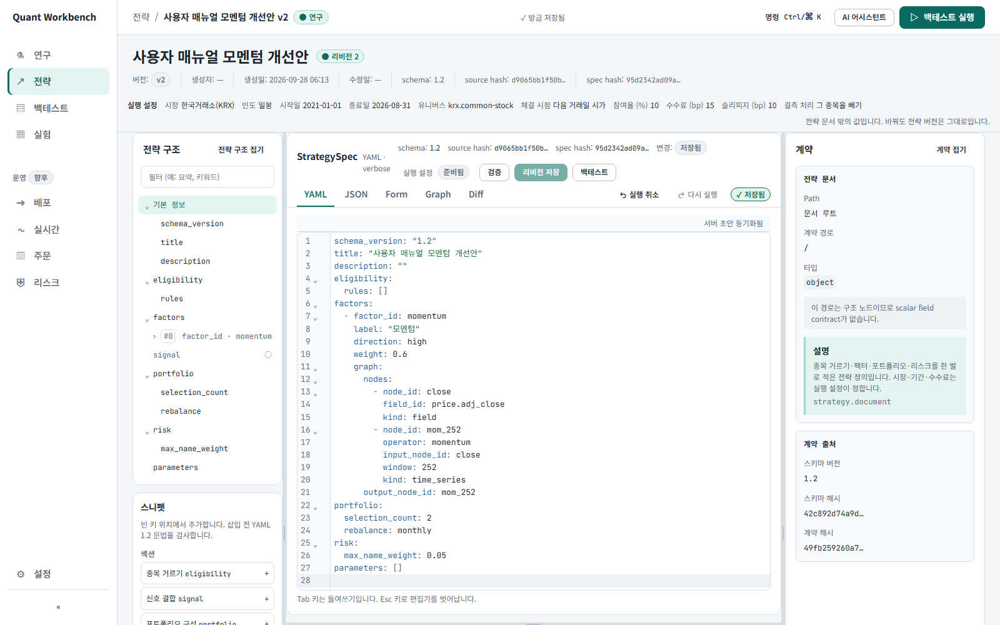

- 빈 칸이 있으면 `실행 설정에서 시작일·종료일·유니버스 칸을 채우세요.`처럼 빈 칸 이름을 모은 문장과
  `실행 설정 채우기` 버튼이 뜬다. 버튼을 누르면 패널이 열리고 첫 빈 칸으로 커서가 간다.
- 값이 틀린 칸이 있으면 `실행 설정의 {칸 이름} 칸을 고치세요: {이유}` 모양의 문장과 `실행 설정 고치기`
  버튼이 뜬다.
- 띠 끝의 `전략 문서 밖의 값입니다. 바꿔도 전략 버전은 그대로입니다.`는 늘 보이는 안내다.
- `실행 설정` 버튼 옆 배지는 실행할 수 있으면 `준비됨`, 아니면 `입력 확인`이다.

### 막힌 화면도 한 번 확인하기

실행 설정 칸을 모두 채운 채 초기 자본에 `0`을 넣어 본다. 서버가 받지 않는 값이라 패널이 먼저 막는다.
요청은 나가지 않고 `백테스트` 버튼이 잠긴다. 배지는 `입력 확인`으로 바뀐다. 패널 아래 오류 목록에는
`초기 자본: 0보다 큰 숫자를 입력하세요.`가 뜬다.

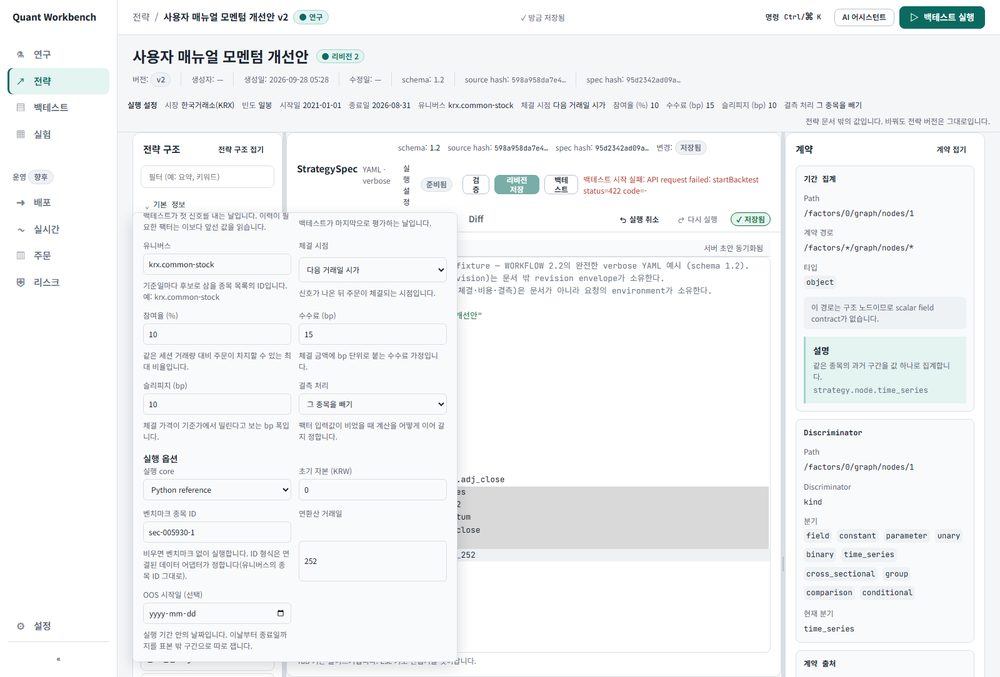

요약 띠는 `실행 설정의 초기 자본 칸을 고치세요: 0보다 큰 숫자를 입력하세요.`라고 말한다. 띠의
`실행 설정 고치기`를 누르면 패널이 열리고 초기 자본 칸으로 커서가 간다. 연환산 거래일도 1 이상이어야
한다.

패널이 막지 못한 값을 서버가 거절하면 툴바 아래에 `백테스트 시작 실패: ` 뒤로 무엇을 고칠지 알려 주는
한글 문장이 뜬다. 서버가 칸을 짚으면 `서버가 실행 설정의 초기 자본 칸 값을 받지 않았습니다.`처럼 그 칸
이름을 말한다. 그 아래 `서버 사유`를 펼치면 서버가 보낸 원문을 볼 수 있다.

초기 자본을 `100000000`으로 고치고 실행한다. 완료되면 아래 결과 화면으로 이동한다.

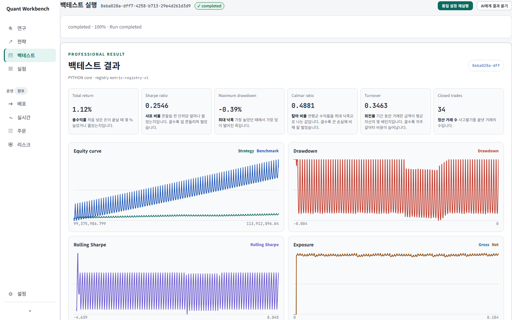

결과 화면 제목 옆에는 실행 제어 버튼이 하나 있다. 실행 중에는 `실행 취소`(누르면 `취소 요청됨`)이고,
끝난 뒤에는 `동일 설정 재실행`이다. 재실행은 서버가 받아 둔 요청을 그대로 다시 보내 새 실행을
만든다. 편집기의 되돌리기 버튼도 이름이 `실행 취소`지만 서로 다른 버튼이다.

서버는 한꺼번에 계산하는 백테스트 수를 묶어 둔다. 그보다 많이 시작하면 뒤의 실행은 진행 줄에
`queued · 0% · Waiting for a free run slot`을 띄운 채 앞 실행이 끝나기를 기다린다. 자리를 기다리는
실행을 `실행 취소`하면 바로 `cancelled`가 된다. 같은 문서·실행 설정·실행 옵션으로 도는 실행이 있을 때
`백테스트`를 다시 누르면(새로고침한 뒤 포함) 새 실행을 만들지 않고 그 실행 화면으로 간다. 결과 화면을
떠나도 서버 실행은 끝까지 돈다. 필요 없어진 실행은 `실행 취소`로 멈춘다.

처음에는 맨 위 강조 숫자만 확인해도 된다. 숫자마다 아래에 한글 이름과 한 줄 뜻이 함께 나오니
그 문장을 읽으면 된다.

| 화면의 영문 이름      | 한글 이름      |
| --------------------- | -------------- |
| Total return          | 총수익률       |
| Sharpe ratio          | 샤프 비율      |
| Sharpe standard error | 샤프 비율 오차 |
| Maximum drawdown      | 최대 낙폭      |
| Calmar ratio          | 칼마 비율      |
| Turnover              | 회전율         |
| Closed trades         | 청산 거래 수   |

그 아래에는 자산 곡선, 낙폭, Rolling Sharpe, 노출도와 월별 수익률이 있다. 맨 아래
`Manifest · 데이터 경고 · 재현성 정보`에는 나중에 같은 실행을 다시 찾기 위한 전략 버전, 데이터,
엔진 정보와 이번 실행의 `실행 설정`·`실행 설정 hash`가 들어 있다. 같은 전략을 기간만 바꿔 돌렸다면
전략 hash는 같고 실행 설정 hash만 다르다. `Data snapshot`은 `원천 판:필드 계약 판` 두 부분이다.
앞부분은 원장 테이블 빌드(mock이면 fixture 데이터)가, 뒷부분은 필드를 읽는 규칙(필드 선언·카탈로그
매크로)이 정한다. 원장을 다시 짓지 않고 필드의 뜻만 바뀌어도 뒷부분과 실행 지문이 바뀐다. 필드 설명
같은 문장만 고친 변경으로는 바뀌지 않는다.

### 결과의 N/A와 데이터 경고 읽는 법

값을 낼 수 없는 지표는 숫자 대신 `N/A`가 되고, 그 아래에 이유가 한 줄 붙는다.

| 이유 문장                                   | 흔한 원인                              |
| ------------------------------------------- | -------------------------------------- |
| 수익률 변동이 없어 계산할 수 없습니다       | 한 번도 사고팔지 않아 자산이 그대로다  |
| 손실 쪽 변동이 없어 계산할 수 없습니다      | 손실 난 날이 없다                      |
| 낙폭이 없어 계산할 수 없습니다              | 자산이 한 번도 고점 아래로 내려가지 않았다 |
| 최대 낙폭에서 아직 회복하지 않았습니다      | 기간 끝까지 고점을 되찾지 못했다       |
| 벤치마크 값이 비어 계산할 수 없습니다       | 벤치마크를 비웠거나 기간 앞부분에 가격이 없다 |
| 청산된 거래가 없어 계산할 수 없습니다       | 끝까지 판 거래가 없다                  |
| 손실로 청산된 거래가 없어 계산할 수 없습니다 | 청산한 거래가 모두 이익이었다          |
| 이 구간에 관측이 없어 계산할 수 없습니다    | OOS 같은 평가 구간에 거래일이 없다     |

이유를 적은 데이터 경고가 있으면 문장 뒤에 `데이터 경고에서 이유 보기` 링크가 붙는다. 누르면 맨 아래
`Manifest · 데이터 경고 · 재현성 정보`가 펼쳐지고 그 경고로 화면이 옮겨 간다.

데이터 경고는 `Data warnings` 아래에 한 줄씩 나온다. 아는 경고는 한글 제목, 서버가 쓴 설명, 경고 코드
순서로 보이고, 한글 제목이 없는 경고는 코드가 제목 자리에 온다. 자주 보는 한글 제목은 이렇다.

- `벤치마크 첫 가격보다 앞선 구간이 있어 전체 구간 벤치마크 비교를 쓸 수 없습니다`
- `벤치마크 거래정지 세션은 직전 가격을 이어 썼습니다`
- `벤치마크 상장이 끝난 뒤 세션은 마지막 값으로 멈췄습니다`
- `벤치마크 원장 행이 무효인 거래일은 직전 가격을 이어 썼습니다`
- `섹터를 모르는 종목은 섹터 제약에서 뺐습니다`

연습 데이터(mock)로 돌리면 `mock_equity_data`와 `corporate_action_feed_empty` 두 경고가 늘 코드 이름으로
뜬다. 가짜 시세로 돌렸고 분할·병합 같은 기업 행동 자료를 비워 두었다는 안내라 정상이다.

> 이 샘플의 수익률은 개발용 가짜 시세 결과다. 숫자의 좋고 나쁨보다 화면과 계산 흐름이 제대로
> 연결되는지만 확인한다.

## 7. 저장한 전략 다시 편집하기

기존 전략 편집 기능은 이미 있다.

1. 왼쪽 메뉴에서 `전략`을 누른다.
2. 원하는 전략의 `최신본 열기`를 누른다.
3. 예전 버전을 고치려면 `Revision 펼치기`를 누르고 원하는 vN의 `편집`을 누른다.
4. 버전끼리 비교하려면 같은 줄의 `Diff`를 누른다.

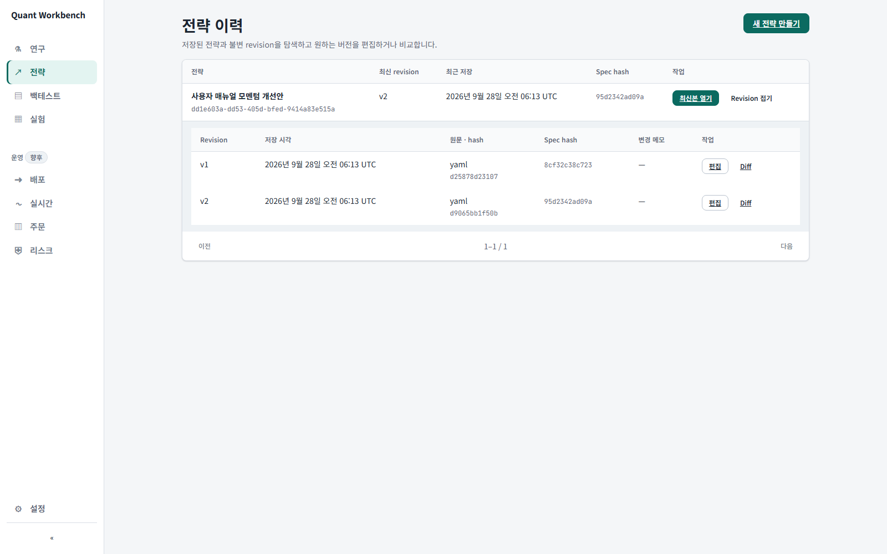

다른 브라우저 탭에서 누군가 먼저 새 버전을 저장했다면 `리비전 충돌` 배너가 나온다. 작성 중인 글은
그대로 남고 자동으로 합치지 않는다. 배너의 버튼으로 이렇게 고른다.

- `현재 문서 복사`: 지금 글을 클립보드에 복사해 둔다.
- `서버본 열기 (vN)`: 먼저 저장된 최신본을 연다. 복사해 둔 변경을 거기에 다시 적용한다.
- `Diff 열기`: 내 기준 버전과 서버 최신본의 의미 차이를 본다.
- `현재 전체 문서로 vN 생성`: 차이를 확인했고 내 글이 맞다면 지금 글 전체로 새 버전을 만든다.

백테스트 결과는 왼쪽 `백테스트`에서 다시 연다.

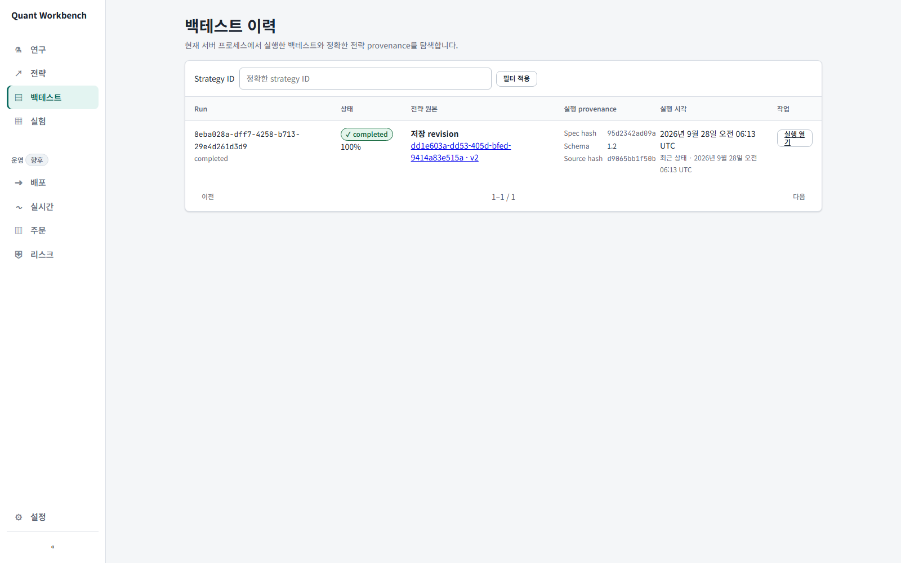

### 옛 전략(1.0·1.1) 열기

schema 1.2 전에 저장한 전략도 지워지지 않고 남아 있다. `전략` 목록에서 그런 전략과 revision 줄에는
`이전 버전 동결` 배지가 붙는다. 옛 revision은 그대로는 백테스트도 추적도 할 수 없으니 먼저
업그레이드해 새 revision으로 저장한다.

1. 배지가 붙은 revision을 연다(`최신본 열기` 또는 그 vN의 `편집`).
2. 편집기 위에 `이전 schema 문서` 배너가 뜬다.
3. `현재 버전으로 업그레이드`를 누른다. 주석과 순서를 유지한 채 편집기 글이 지금 버전으로 바뀐다.
   마음에 들지 않으면 실행 취소 한 번으로 되돌린다.
4. 배너에 `업그레이드하면서 알아 둘 점`이 뜨면 읽는다. 예를 들어
   `팩터마다 달랐던 결측 처리를 하나로 합쳤습니다`, `점수 비례 비중의 계산 규칙이 바뀌었습니다`처럼
   계산이 조금 달라지는 곳을 알려 준다.
5. 옛 문서의 `data`·`execution`에 있던 값은 새 문서에서 빠지고, 배너에
   `옛 문서에 있던 실행 설정: 2021-01-01 → 2026-08-31 · krx.common-stock` 같은 줄로 보인다.
   `실행 설정에 채우기`를 누르면 그 값이 실행 설정 칸에 들어간다. 누르기 전에는 지금 실행 설정을 덮지
   않는다. `옛 문서의 실행 설정을 옮기지 못해 실행 설정을 채우지 않았습니다. …`가 뜨면 6절 표를 보고
   직접 채운다.
6. `검증 통과`를 확인하고 `리비전 저장`을 눌러 새 revision을 만든다. 옛 revision은 그대로 남는다.
   옛 샘플처럼 모멘텀이 원주가 `price.close`를 읽으면 업그레이드 뒤 문제 목록에 원주가 경고가 뜬다.
   업그레이드는 필드를 바꾸지 않기 때문이다. 저장은 되지만, 3절 표대로 `price.adj_close`로 바꿔 저장하는
   편이 맞다.

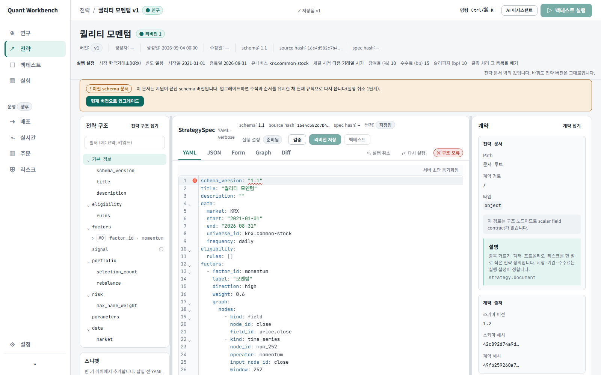

저장해 두지 않은 옛 YAML도 같은 길로 올린다. `새 전략`을 열고 옛 YAML을 붙여 넣으면 같은 배너가
뜬다. 위 3~6번을 그대로 따른다. 6번에서 `리비전 저장`을 누르면 revision 1로 새 전략이 생기고, 채운 실행
설정은 그 전략 화면에 그대로 이어진다. 다만 사생활 모드처럼 브라우저 저장소(localStorage)를 쓸 수 없으면
이어지지 않으니, 저장 뒤 실행 설정 요약의 기간·유니버스를 확인한다. 위 스크린샷은 저장된 revision
화면이지만 배너와 버튼은 같다.

## 8. 그래프와 YAML에서 고치기

새 전략과 저장된 revision은 `그래프` 탭으로 열린다. 다른 표현은 `YAML` 하나다. 옛 Form 링크는
그래프로, JSON 링크는 YAML로 이어진다. 저장된 JSON 원문도 바이트를 유지한 채 YAML 1.2로 읽는다.

- 단계 카드에서 조건·팩터·포트폴리오·리스크 값을 고친다. 숫자·글자는 Enter나 다른 곳 클릭으로,
  가중치 막대는 끌기를 마칠 때 반영된다. 같은 YAML 줄을 고치는 한 번의 편집이므로 주석과 순서,
  실행 취소·다시 실행이 유지된다. 팩터의 표시 이름과 내부 식별자는 별개다.
- `항목 추가`로 빈 팩터를 만든 뒤 `레시피 열기`에서 기존 그래프 편집기의 연산자 팔레트를 사용한다.
  데이터 필드·입력 연결·출력 노드를 정한다. 아직 없는 새 팩터의 실행 계획을 기다릴 필요는 없다.
  노드 이름 변경은 같은 그래프의 입력 연결과 출력을 함께 고치며, 참조 중인 노드는 삭제할 수 없다.
- 캔버스 아래 `선정 미리보기`는 `미리보기 새로고침`을 눌러야 조회한다. 기준일을 비우면 서버가 마지막
  리밸런싱 프레임을 고르고 조회 기준일을 보여 준다. 전체·적격·조건 탈락·순위 탈락·결측 수와 선정
  종목의 순위·이름·종합 점수는 서버 결과다. 문서나 실행 설정을 바꾸면 다시 새로고침한다.
- 문제 행을 누르면 해당 카드의 가장 구체적인 편집 칸이나 고급 그래프의 노드 행으로 이동한다.
  그 화면에 없는 값은 YAML 원문으로 이동한다. 카드에는 진단 수를, 고급 편집기에는 상세 진단을 보인다.
- 구문 오류가 있으면 마지막으로 읽은 카드 값에 STALE 표시를 붙이고 편집을 잠근다. YAML에서 고친다.
  새 입력 반영 중 위치가 달라질 수 있는 추가·삭제는 파싱이 끝날 때까지 잠시 기다린다.
- revision의 `리비전 변경 비교`는 탭 밖에서 연다. 실행 설정은 문서 밖의 값이므로 이 비교에 들어가지 않는다.

지원 화면 폭 하한은 360px다. 이 버전의 360px·640px 탭 클릭과 새 화면 스크린샷은 클라우드의
브라우저 설치 차단으로 검증 대기 중이다. 기존 `assets/13-form-editing.png` 등은 이전 화면 기록이며
현재 화면의 검증 증거로 사용하지 않는다.

## 9. AI 어시스턴트에게 물어보기

전략 화면 오른쪽에 AI 어시스턴트를 붙일 수 있다. 지금 편집 중인 YAML을 읽고, 인터넷을 찾아보고,
고친 전략을 통째로 제안한다. **문서를 바꾸는 것은 언제나 사람이 누르는 "문서에 적용" 한 번뿐이다.**
어시스턴트가 혼자 저장하거나 백테스트를 돌리지 않는다.

### 9.1 공급자 연결하기

1. 왼쪽 메뉴 맨 아래 `설정`을 연다.
2. `AI 어시스턴트 공급자` 섹션에서 공급자(Claude 또는 Codex), 표시 이름, API 키를 넣는다.
   모델을 비우면 공급자의 기본 모델을 쓴다.
3. `연결 테스트 후 저장`을 누른다. **연결 테스트를 통과한 키만 저장된다.**
4. 카드에 `활성` 배지가 붙으면 준비가 끝난 것이다. 연결이 여러 개면 `활성으로 사용`으로 바꾼다.

`설치 필요`라고 적힌 공급자는 서버에 그 SDK가 없다는 뜻이다. backend에서 해당 extra를 설치하고
서버를 다시 시작한다.

키는 서버의 사용자 설정 디렉터리에 현재 사용자만 읽을 수 있는 파일로 저장된다. 화면에는 꼬리
4자리만 보이고, 응답·로그·DB 어디에도 평문으로 남지 않는다. `고급 설정`의 `base_url`은 접어 두면
전송되지 않는다 — 적어 두고 접으면 `base_url 미적용` 배지가 그 사실을 알린다.

### 9.2 사이드바에서 묻기

전략 화면 위쪽 `AI 어시스턴트` 버튼(`Alt+A`)을 누르면 오른쪽에 대화창이 열린다. `YAML`, `그래프` 어느 탭에서 보든 같은 대화다.

질문을 보낼 때마다 **지금 편집기에 있는 글과 오류 목록, 실행 설정**이 함께 간다. 그래서 "이 전략
어디가 문제야?" 처럼 문서를 가리키는 질문이 그대로 통한다.

- 답은 한 글자씩 흘러 나온다. `중지`를 누르면 그 자리에서 멈춘다.
- 인터넷을 찾아본 경우 `웹 검색` 칩과 함께 찾아본 문장과 출처가 보인다. 출처 옆의 `도착지 …`는
  링크가 실제로 가는 주소다 — **제목이 아니라 그 호스트를 보고 클릭할지 정한다.**
- 한 답변이 쓸 수 있는 검색 횟수는 정해져 있다. 다 쓰면 칩 대신 "이 답변에서 쓸 수 있는 웹 검색
  횟수를 모두 썼습니다" 안내가 한 줄 보이고, 답은 그때까지 찾은 자료로 이어진다. 오류가 아니다.
- 답을 기다리는 동안 다른 탭으로 가거나 화면을 새로고침해도 된다. 대화는 서버에 남고, 돌아오면
  이어서 받는다.

### 9.3 제안을 문서에 적용하기

전략 제안이 오면 카드로 뜬다. 카드에는 제목, 한 줄 요약, 근거, 출처, 그리고 서버가 매긴
`검증 통과` / `검증 실패` 배지가 있다. 이 배지는 사람이 `검증`을 눌렀을 때와 **같은 검사** 결과다.

- `미리보기`: 문서를 건드리지 않고 지금 글과 제안의 줄 단위 차이만 본다.
- `문서에 적용`: 제안이 편집기 전체를 대신한다. 적용 후 화면 위 상태가 `검증 통과`로 바뀌는지
  확인한다. **실행 취소(`Ctrl+Z`) 한 번이면 적용 전으로 돌아간다.**
- `적용 후 백테스트`: 적용한 문서가 검증을 통과하고 실행 설정이 채워져 있으면 바로 백테스트를 시작해
  실행 화면으로 간다. 그렇지 않으면 문서만 바뀌고
  `제안을 문서에 적용했지만 지금은 실행할 수 없어 백테스트를 시작하지 않았습니다. 실행할 수 있게 되면 직접 실행하세요.`
  가 막힌 이유와 함께 뜬다.

답을 기다리는 동안 문서를 고쳤다면 바로 덮어쓰지 않고 `문서가 바뀌었습니다` 창이 먼저 뜬다.
거기서 차이를 보고 `그래도 덮어쓰기`를 고를 수 있고, 그 경우에도 실행 취소 한 번으로 되돌아간다.

적용한 뒤에도 저장은 따로 해야 한다. `리비전 저장`을 눌러야 새 버전이 된다.

### 9.4 백테스트 결과를 AI에게 묻기

백테스트가 끝나면 결과 화면 제목 옆에 `AI에게 결과 묻기` 버튼이 생긴다. 누르면 오른쪽에
`AI 어시스턴트` 패널이 열리고 이런 안내가 보인다.

```text
이 실행의 숫자를 쉬운 말로 풀어 줍니다. "이 결과 좋은 거야?"처럼 물어보세요. 이 대화는 전략 문서를 바꾸지 않습니다.
```

"샤프 비율이 무슨 뜻이야?", "왜 이 지표가 N/A야?"처럼 이 실행의 지표와 데이터 경고를 물으면 된다.

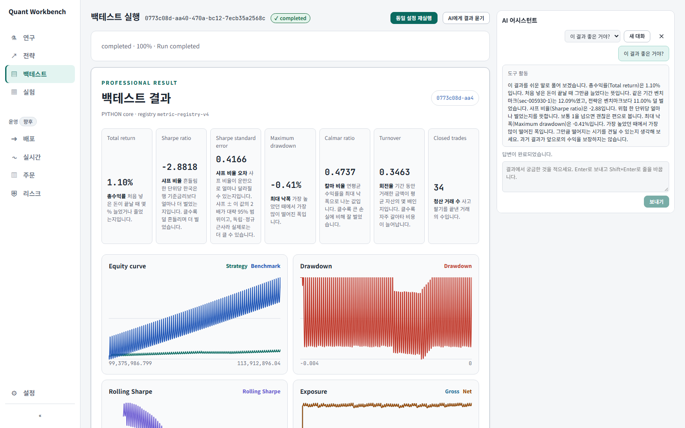

- 공급자를 연결하지 않았으면 패널에 `연결된 AI 공급자가 없습니다`가 뜬다. 9.1대로 먼저 연결한다.
- 결과는 서버가 켜져 있는 동안만 읽을 수 있다. 서버를 다시 시작한 뒤 물으면
  `이 백테스트 결과를 더 이상 읽을 수 없습니다. …`가 뜨니 백테스트를 다시 돌리고 묻는다.

### 9.5 알아 둘 것

- 어시스턴트가 낸 전략은 **초안**이다. 숫자와 기간이 의도대로인지 사람이 확인한 뒤 저장한다.
- 검색 결과는 이 기능에서 유일하게 바깥에서 들어오는 글이다. 본문은 언제나 평문으로만 그리고,
  `http`·`https`가 아닌 주소는 링크로 만들지 않는다.
- 제안이 서버 검증을 통과하지 못하면 카드가 뜨지 않고 `모델이 낸 전략이 검증을 통과하지
  못했습니다.` 로 턴이 끝난다. 질문을 좁혀 다시 물어본다.
- 실제 공급자를 부르지 않고 화면 흐름만 확인하려면 개발용 대본 공급자를 쓴다
  (`frontend/e2e/README.md`의 "AI assistant scenarios"). 실제 공급자로 한 번 확인하는 절차는
  [AI 어시스턴트 WORKFLOW](../../planning/ai-assistant/WORKFLOW.md)의 A-07 절
  (`STRATEGY_WORKBENCH_LIVE_SMOKE=1` smoke, `backend/scripts/assistant_live_smoke.py`)과 그 아래
  "Phase A exit" 항목에 있다. 이 변수를 `1`로 주지 않으면 스크립트는 공급자를 부르지 않고
  끝나므로, 출력에 공급자별 확인 항목이 나왔는지 본다.

## 10. 자주 쓰는 단축키

`Ctrl+K`를 누르면 `전략 명령 팔레트`가 열린다. macOS에서는 `Ctrl` 대신 `⌘`를 쓴다. 명령은 `실행`,
`표현`, `패널`, `테마`, `문서 경로` 묶음으로 나뉘고, 검색칸에 명령 이름이나 JSON Pointer, 팩터·노드 ID를
치면 목록이 좁혀진다.

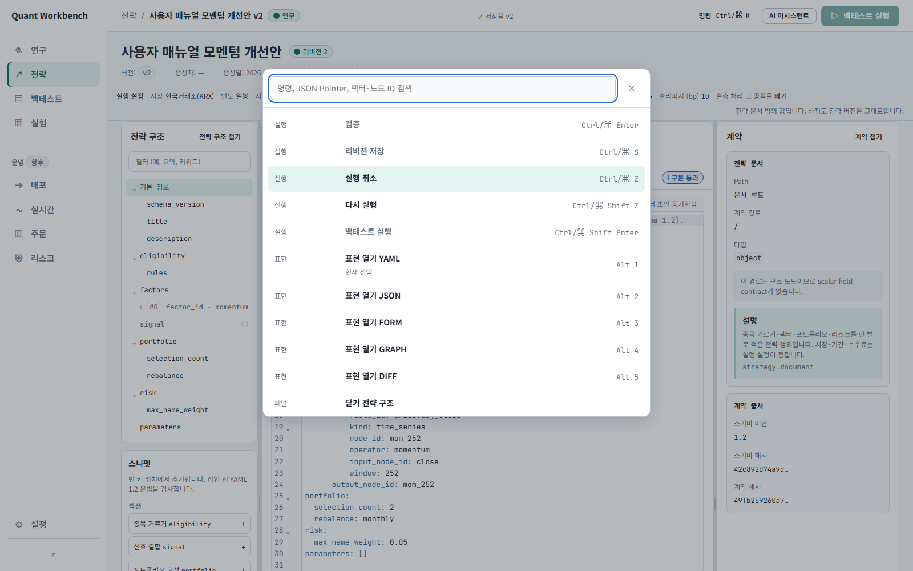

| 키                   | 동작                                  |
| -------------------- | ------------------------------------- |
| `Ctrl/⌘+K`           | 전략 명령 팔레트 열기                 |
| `Ctrl/⌘+Z`           | 실행 취소(되돌리기)                   |
| `Ctrl/⌘+Shift+Z`     | 다시 실행                             |
| `Ctrl/⌘+Enter`       | 현재 YAML 검사                        |
| `Ctrl/⌘+S`           | 새 버전 저장                          |
| `Ctrl/⌘+Shift+Enter` | 백테스트 실행                         |
| `Alt+1` / `Alt+2`    | 그래프 / YAML 탭 이동 |
| `Alt+A`              | AI 어시스턴트 사이드바 열기·닫기       |

## 막혔을 때 이것부터 확인하기

| 문제                              | 해결 방법                                  |
| --------------------------------- | ------------------------------------------ |
| 화면 자체가 안 열림               | 저장소 루트에서 `npm run dev` 실행         |
| 화면은 열리지만 검사·저장이 안 됨 | `uv run server`가 실행 중인지 확인         |
| backend 확인 필요                 | <http://127.0.0.1:8000/api/v1/health> 열기 |
| Rust `CoreUnavailable`            | 우선 `Python reference`로 실행             |
| 422 오류                          | 실행 설정 칸이 모두 찼는지, 초기 자본·연환산 거래일이 0보다 큰지 확인 |
| `추적 실행`·`백테스트`가 눌리지 않음 | 요약 띠의 `실행 설정에서 … 칸을 채우세요.` 문장을 읽고 `실행 설정 채우기`를 누른다(6절) |
| 옛(1.0·1.1) YAML을 붙이니 `지원하지 않는 schema_version입니다` | 편집기 위 `이전 schema 문서` 배너에서 `현재 버전으로 업그레이드`를 누른다(7절) |
| 결과에 `mock_equity_data` 경고    | 연습 데이터로 돌리면 늘 뜬다. 정상(6절)     |
| 저장 버튼이 비활성                | 화면 위 상태가 `검증 통과`인지 확인        |
| STALE 표시                        | 아래 `문제` 목록의 첫 오류부터 수정        |
| 저장한 전략이 안 보임             | 서버가 이전과 같은 DB 경로를 쓰는지 확인   |
| 사이드바에 "연결된 AI 공급자가 없습니다" | `설정`에서 공급자를 등록하고 활성으로 둔다 |
| 공급자가 `설치 필요`              | backend에 그 공급자 extra를 설치하고 재시작 |

## 용어가 헷갈릴 때

| 용어             | 이 문서에서의 뜻                                          |
| ---------------- | --------------------------------------------------------- |
| YAML             | 매매 규칙을 적는 설정 파일                                |
| 리비전(revision) | 한 번 저장한 전략 버전. v1, v2처럼 표시                   |
| 노드(node)       | 종가 읽기, 252일 모멘텀처럼 계산 한 단계                  |
| TargetTape       | 종목별 점수·순위·선택 여부·목표 비중 표                   |
| hash             | 내용이 같은지 확인하는 짧은 지문                          |
| PIT              | 그 날짜 당시에 알 수 있었던 데이터만 사용한다는 뜻        |
| TTM              | 최근 4분기 합. 재무 흐름 필드(매출·이익·영업현금)의 기간  |
| 실행 설정(RunEnvironment) | 시장·기간·유니버스·체결·비용·결측 처리처럼 전략 문서 밖에서 실행마다 정하는 값 |
| 유니버스         | 기준일마다 후보로 삼을 종목 목록. 예: `krx.common-stock` |
| inline draft     | 아직 버전으로 저장하지 않은 현재 YAML                     |
| STALE            | 현재 YAML이 아니라 마지막 정상 계산 결과를 보여 주는 상태 |

여기까지 따라 했다면 전략 작성, 실행 설정, 중간값 확인, 저장, 기존 전략 편집, 백테스트의 기본 흐름을 모두
사용한 것이다.

<details>
<summary>개발자용: Rust core 설치와 문서 화면 다시 캡처하기</summary>

Persistent Rust core를 사용하려면 한 번 빌드한다.

```powershell
cd backend
uv sync
uv run maturin develop --manifest-path rust/backtest_core/Cargo.toml --release
cd ..
```

`npm run docs:capture`는 mock 데이터로 샘플을 붙여 넣고, 실행 설정(시작일 `2021-01-01`, 종료일
`2026-08-31`, 유니버스 `krx.common-stock`)을 채운 뒤 `assets/`의 01~20번 20장을 다시 찍는다. 뷰포트는
1600×1000, 로케일은 `ko-KR`, 테마는 라이트다. 실제 전략과 백테스트 데이터가 생기므로 새 임시 DB를
쓴다. 19번(AI 결과 설명)은 실제 공급자 대신 개발용 대본 공급자로 찍으므로, AI 설정도 같은 임시
폴더에 둔다.

```powershell
# 터미널 1: 백엔드(mock 데이터, 새 DB)
$manualRunName = "quant-study-manual-$([guid]::NewGuid().ToString('N'))"
$manualRoot = Join-Path ([IO.Path]::GetTempPath()) $manualRunName
New-Item -ItemType Directory $manualRoot | Out-Null
$env:STRATEGY_WORKBENCH_DB_PATH = Join-Path $manualRoot "strategy-workbench.sqlite3"
$env:STRATEGY_WORKBENCH_ASSISTANT_DB_PATH = Join-Path $manualRoot "assistant.sqlite3"
$env:STRATEGY_WORKBENCH_ASSISTANT_SECRETS_PATH = Join-Path $manualRoot "assistant-secrets.json"
$env:STRATEGY_WORKBENCH_ASSISTANT_FAKE_PROVIDER = "1"
$env:STRATEGY_WORKBENCH_DB_PATH # 이 경로를 터미널 3에 넣는다
uv run server
```

```powershell
# 터미널 2
npm run dev
```

```powershell
# 터미널 3
cd frontend
npx playwright install chromium # clean checkout에서는 처음 한 번 필요
$env:WORKBENCH_MANUAL_DB_PATH = "<터미널 1이 출력한 DB 경로>"
$env:WORKBENCH_MANUAL_HEADED = "1" # 브라우저를 띄워 보고 싶을 때만
npm run docs:capture
```

위 첫 명령은 실행할 때마다 새 GUID 폴더를 만들기 때문에 이전 전략과 백테스트가 캡처에
섞이지 않는다. 특히 11번(전략 목록)은 새 DB에서 찍어야 이번 실행만 보인다. 스크립트도 이번 실행에서
만든 전략 ID와 실행 ID가 이력 화면에 있는지 확인한다. 17번(업그레이드 배너)에 필요한 schema 1.1
revision은 화면으로 만들 수 없어, 스크립트가 `WORKBENCH_MANUAL_DB_PATH`의 DB에 직접 심는다. 그래서 이
값은 백엔드의 `STRATEGY_WORKBENCH_DB_PATH`와 같은 파일이어야 한다.

8000·5173 포트를 다른 체크아웃의 서버가 쓰고 있으면 기본이 아닌 포트로 띄운다. 스크립트는 e2e와
같은 `PW_BACKEND_PORT`·`PW_PREVIEW_PORT`로 두 포트를 읽는다. 아래 `18931`·`15931`은 예시다.

```powershell
# 터미널 1: 위 환경 변수를 그대로 두고 두 줄만 바꾼다
$env:STRATEGY_WORKBENCH_ALLOWED_ORIGINS = "http://localhost:15931"
uv run server --port 18931
```

```powershell
# 터미널 2: 프론트엔드가 부를 백엔드 주소를 넣고 띄운다
$env:VITE_API_BASE_URL = "http://localhost:18931"
npm.cmd run dev -- --port 15931 --strictPort
```

```powershell
# 터미널 3
cd frontend
$env:WORKBENCH_MANUAL_DB_PATH = "<터미널 1이 출력한 DB 경로>"
$env:PW_BACKEND_PORT = "18931"
$env:PW_PREVIEW_PORT = "15931"
npm run docs:capture
```

터미널 2에서 `npm`이 아니라 `npm.cmd`를 쓰는 이유가 있다. Windows PowerShell 5.1은 `npm`을 `npm.ps1`로
부르면서 `--`를 삼킨다. 그러면 `--port`·`--strictPort`가 vite에 닿지 않고 프론트엔드가 기본 5173에 뜬다.
PowerShell 7이나 bash에서는 `npm run dev -- …`도 된다.

찍기 전에 두 포트를 잡은 프로세스가 이 체크아웃에서 띄운 것인지 확인한다. 옆 체크아웃의 서버를 물고
찍으면 다른 코드의 화면이 찍힌다. 다 찍으면 두 서버를 끄고 임시 폴더를 지운다.

</details>

개발 구조와 계약을 더 자세히 보려면 다음 문서를 읽는다.

- [메인 README](../../../README.md)
- [전략 작성 계약](../../superpowers/specs/2026-09-04-strategy-authoring-contract-adr.md)
- [schema 1.2와 실행 설정 설계](../../superpowers/specs/2026-09-20-strategy-language-2-0-and-pipeline-canvas-design.md)
- [전략 언어 2.0 진행표](../../planning/strategy-language-2-0/PLAN.md)
- [YAML 워크벤치 구현 진행표(완료)](../../planning/strategy-workbench-yaml-ui/PLAN.md)


### 팩터 레시피 편집

파이프라인 팩터 카드의 **레시피 열기**에서 단계 목록을 편집한다. 빈 팩터는 데이터 필드를 고른 뒤
시작하며, 단계 제목을 선택하면 팔레트의 다음 연산이 그 뒤에 들어간다. 다중 입력 연산은 앞 단계가
들어갈 입력과 추가 데이터 필드를 먼저 묻고, 취소하면 원문을 바꾸지 않는다. 설정 칸은 Enter/blur로
확정하고 Escape로 취소한다. 위로/아래로/삭제/연산 교체도 원문 편집 한 번이어서 툴바의 실행 취소와
다시 실행으로 되돌릴 수 있다. 첫 데이터 단계는 뒤 단계가 남은 동안 이동/삭제할 수 없다.

분기 그래프는 **고급으로**에서 편집한다. **파이프라인으로**와 브라우저 뒤로가기는 편집 원문을
유지한다. 식별자는 기본적으로 접혀 있으며 **식별자(YAML)**에서 확인할 수 있다. 결과 타입과 단위는
컴파일 응답을 표시한다.

그래프의 **선정 미리보기**에서 팩터와 기준일을 고르고 **미리보기 새로고침**을 누른다.
날짜를 비우면 마지막 실행 가능한 리밸런스 신호일을 쓴다. 값 있는 종목 수·결측 종목 수는
실행 설정의 결측 처리를 적용한 뒤의 유니버스 전체 수다. 조건에서 탈락하거나 최종 선정되지 않은
종목도 이 팩터 결과에는 포함된다. 상위 5개는 선택한 팩터의 높을수록/낮을수록 방향을 따른다.
아래 선정 종목 표는 종합 점수로 고른 실제 포트폴리오이며 팩터 상위값과 별개다.
문서·실행 설정·팩터·날짜를 바꾸면 이전 결과를 숨기고 새로고침을 요구한다. 실행 중에는 취소할 수 있다.


### 같은 주 점수의 종목 순서를 정하기

그래프의 포트폴리오 구성에서 **동점 해소 팩터**와 **동점 해소 방향**을 고른다.
보조 팩터도 일반 팩터처럼 레시피로 만들 수 있고 특정 지표로 제한되지 않는다.
선택한 보조 팩터는 alpha 합성에서 빠지므로 주 점수를 낼 팩터를 따로 남겨야 한다.

주 점수가 다르면 보조값은 선정 순서를 바꾸지 않는다. 주 점수가 같을 때만 지정 방향으로
비교한다. 실행 설정의 결측 처리를 거친 뒤에도 값이 없으면 유효값 뒤로 보내며,
보조값까지 같으면 기존 종목 ID 순서를 유지한다. 보조 팩터 카드의 가중치와 방향 대신
포트폴리오의 **동점 해소 방향**을 쓴다. 설정을 바꾼 뒤 **미리보기 새로고침**으로 결과를 확인한다.

### 그래프만으로 만드는 다섯 가지 전략

**새 전략**의 기본 **그래프** 탭에서 시작한다. 위 **문서 속성**에 전략 이름을 적고,
**알파 팩터 → 항목 추가**에서 표시 이름을 정한 뒤 **레시피 열기**를 누른다.
첫 단계는 **데이터 필드**, 다음 단계는 팔레트에서 연산을 고른다. 숫자 칸은 Tab 또는 Enter로
확정한다. 레시피를 마치면 **파이프라인으로** 돌아온다. 아래 예제는 모두 선택 종목 수 20,
종목별 최대 목표 비중 상한을 0.05(5%)로 설정하고, 마지막 예제만 0.1(10%)로 바꾼다.

정본 문서와 동일한 ID로 재현하려면 팩터 카드의 **식별자(YAML)**를 열어 아래 ID를 입력하고
다시 닫는다. 일반 제작에는 이 단계가 필요 없다. ID를 바꾸면 이 팩터를 가리키는 동점·역가중
설정도 함께 바뀌며 한 번의 **실행 취소**로 같이 돌아온다. 이름 오류를 문제 목록에서 누르면
접힌 입력이 자동으로 열린다.

1. **12-1 모멘텀**: 같은 이름의 팩터를 만들고 큰 값 우선을 고른다. 레시피는 수정종가
   (`price.adj_close`) → **기간 수익률**, 집계 기간 252·건너뛰는 세션 21이다.
   정본 팩터 ID는 `momentum_12_1`이다.
2. **저PBR + 고ROE**: 유니버스 거르기 규칙에 자본총계(`financial.book_equity`)가 0보다 큰
   조건을 추가한다. **PBR** 팩터는 작은 값 우선, 시가총액 → **나누기** → 추가 입력 자본총계로
   만든다. **ROE** 팩터는 큰 값 우선, 당기순이익 → **나누기** → 추가 입력 자본총계다.
   점수 정규화는 기본 **순위로 맞춘 뒤 가중 합**을 쓴다. 정본 ID는 `pbr`, `roe`다.
3. **20일 이평 돌파**: 같은 이름의 팩터를 큰 값 우선으로 만들고 수정종가 → **기간 평균** 20
   → **초과**, 추가 입력 수정종가로 잇는다. 추가 수정종가가 왼쪽, 평균이 오른쪽인 비교다.
   **동점 비교 모멘텀** 팩터는 수정종가 → **기간 수익률** 60으로 만들고, 포트폴리오의
   **동점 해소 팩터**로 선택해 **큰 값 우선**을 둔다. 주 점수는 돌파의 0/1이고 모멘텀은 동점에만
   쓰인다. 정본 ID는 `ma20_breakout`, `momentum_60`이다. 보조 지표는 다른 레시피로 바꿀 수 있다.
4. **거래대금 상위 20%**: 거르기 규칙의 데이터 필드를 거래대금, 비교 방식을
   **값이 큰 쪽 상위 비율 안에 드는**, 기준값을 0.2로 둔다. **60일 모멘텀** 팩터는 수정종가
   → **기간 수익률** 60이다. 정본 ID는 `momentum_60`이다. 필터는 해당 기준일 거래대금이며
   20일 평균 거래대금을 뜻하지 않는다.
5. **변동성 역가중**: 1번의 **12-1 모멘텀**에 **60일 변동성** 팩터를 더한다. 변동성은 작은 값
   우선이고 수정종가 → **기간 수익률** 2 → **기간 표준편차** 60이다. 비중 산정을
   **위험이 작을수록 크게**, 위험 팩터를 **60일 변동성**, 종목별 최대 비중을 0.1로 둔다.
   정본 ID는 `momentum_12_1`, `volatility_60`이다. 변동성은 alpha 합성에서 빠지고 비중에만 쓰인다.

각 전략을 완성한 뒤 실행 설정의 시작일·종료일·유니버스를 채우고 **미리보기 새로고침**으로
팩터 값과 선정 결과를 확인한다. **백테스트**를 누르면 결과 화면으로 이동한다. 미저장 문서를
떠나는 확인이 뜨면 실행 결과로 이동할지 선택한다. 기간·유니버스는 전략 문서 밖의 실행 설정이다.
