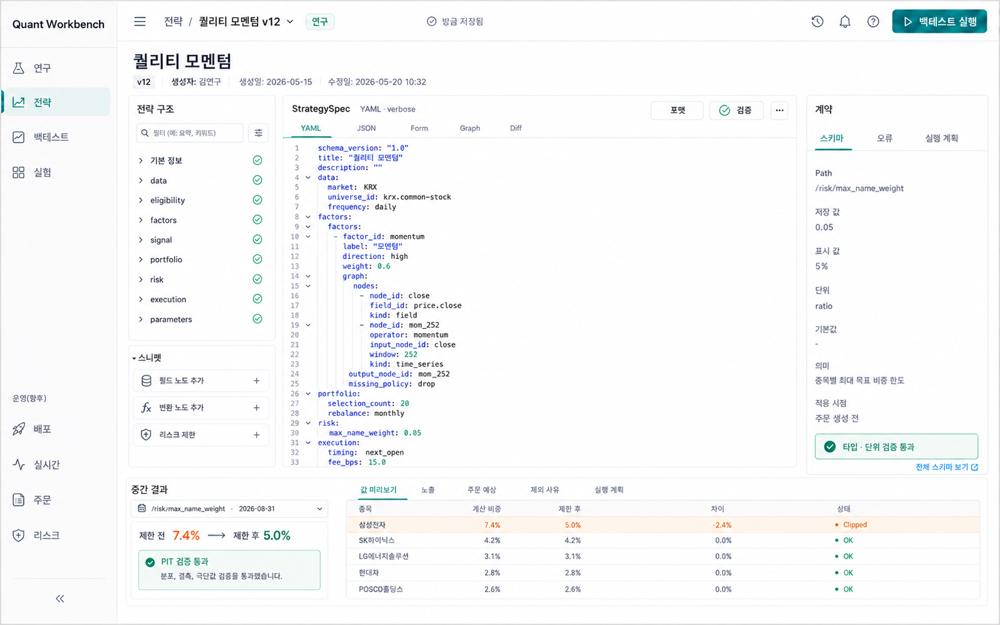

# YAML Strategy Workbench UI 기획 패키지

전문 트레이더용 StrategySpec 문서 IDE 개편의 기획 자료를 한곳에 보관한다.

## 문서 구성

- [WORKFLOW.md](./WORKFLOW.md): 제품 원칙, 전체 Phase/PR 구현 순서, 테스트 및 서브에이전트 리뷰 절차
- [PLAN.md](./PLAN.md): 현재 Phase, PR 상태, 리뷰·검증 결과를 계속 갱신하는 단일 진행 추적 파일
- [assets/strategy-workbench-yaml-ui-concept-v3.png](./assets/strategy-workbench-yaml-ui-concept-v3.png): verbose StrategySpec과 JSON Pointer 표기를 반영한 구현 기준 UI 시안
- [assets/strategy-workbench-yaml-ui-concept-v2.png](./assets/strategy-workbench-yaml-ui-concept-v2.png): verbose YAML로 전환했지만 debugger path가 dot notation인 중간 시안
- [assets/strategy-workbench-yaml-ui-concept.png](./assets/strategy-workbench-yaml-ui-concept.png): DSL·단위 sugar가 포함된 최초 시안. 비교 기록용이며 구현 기준으로 사용하지 않음

## 기준 문서

- 전략 실행 의미의 정본은 backend의 immutable/versioned `StrategySpec`이다.
- YAML/JSON은 authoring source이며 저장할 때 서버가 다시 compile하고 검증한다.
- v1 source는 canonical field name과 raw numeric value를 사용하는 verbose YAML/JSON이다. 표현식 문자열 DSL과 `%`·`bps` literal은 지원하지 않는다.
- `PLAN.md`가 진행 상태의 단일 기준이다. PR 상태를 별도 문서에 중복 기록하지 않는다.
- 상위 제품 milestone의 기준은 기존 Strategy Workbench roadmap이고, `PLAN.md`는 이 UI 개편의 PR 실행 상태만 소유한다. P0-01에서 roadmap이 이 tracker를 링크하도록 정리한다.
- `WORKFLOW.md`의 Phase/PR 범위를 바꾸면 먼저 변경 이유를 `PLAN.md` 변경 기록에 남긴다.

## 진행 상태 갱신 규칙

1. 작업 시작 전에 대상 PR을 `IN_PROGRESS`로 바꾸고 `현재 작업`을 갱신한다.
2. 구현자 검증이 끝나면 `SELF_CHECK`로 바꾸고 검증 명령과 결과를 기록한다.
3. diff를 고정한 뒤 새 리뷰 서브에이전트 한 명을 배정하고 `IN_REVIEW`로 바꾼다.
4. 수정이 생기면 같은 리뷰어가 재검토한다.
5. `APPROVED`와 전체 CI 성공 후 merge하고 체크박스와 상태를 `MERGED`로 바꾼다.
6. PR row와 변경 기록을 수정한 뒤 `tools/update-plan-progress.ps1`을 실행해 frontmatter와 집계를 자동 갱신한다.

계획 문서 생성 자체는 구현 PR 진척도에 포함하지 않는다. 최초 구현 대상은 `P0-01`이다.
